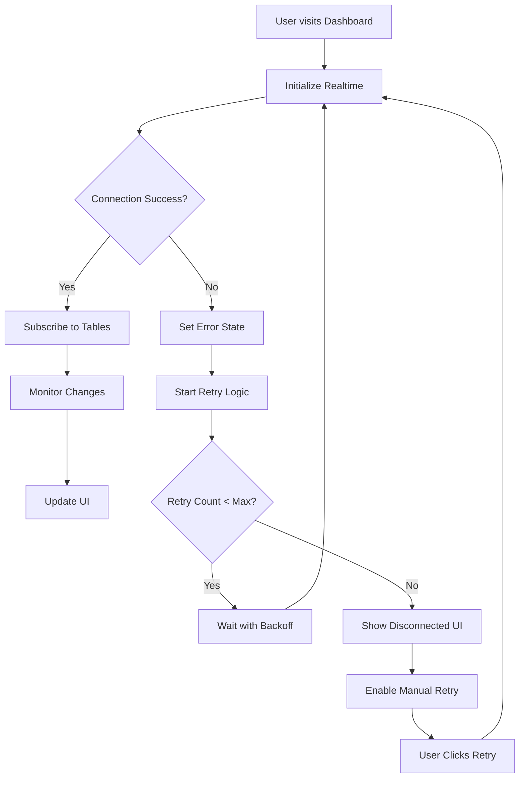

# Dashboard Realtime Error Handling Enhancement Plan

## Executive Summary

This plan outlines improvements to gracefully handle Supabase Realtime connection errors in the dashboard, enhancing user experience while maintaining core functionality.

## Current State Analysis

### Problem
The dashboard realtime hook (`useDashboardRealtime.ts`) logs channel errors to console without:
- Connection state tracking
- Automatic retry mechanisms
- User feedback about connection status
- Graceful degradation

### Affected Component
- **File**: `src/hooks/useDashboardRealtime.ts`
- **Error**: `CHANNEL_ERROR` status triggers console.error without recovery logic

---

## Proposed Solution

### Architecture Overview



---

## Implementation Plan

### Phase 1: Connection State Tracking

**Objective**: Track and expose connection state to UI components

**Changes to `useDashboardRealtime.ts`**:

```typescript
// Add connection state enum
type ConnectionState = "connecting" | "connected" | "disconnected" | "error" | "reconnecting";

// Track state in hook
const [connectionState, setConnectionState] = useState<ConnectionState>("connecting");

// Update on status changes
channel.subscribe((status) => {
  switch (status) {
    case "SUBSCRIBED":
      setConnectionState("connected");
      break;
    case "CHANNEL_ERROR":
      setConnectionState("error");
      break;
    case "CLOSED":
      setConnectionState("disconnected");
      break;
    case "REATTACHING":
      setConnectionState("reconnecting");
      break;
  }
});

// Expose state to consumers
return {
  refreshDashboard,
  connectionState,
  isConnected: connectionState === "connected"
};
```

**Benefits**:
- UI components can react to connection state
- Enables visual feedback
- Supports connection status indicators

---

### Phase 2: Retry Logic with Exponential Backoff

**Objective**: Automatically recover from transient failures

**Implementation**:

```typescript
// Configuration
const MAX_RETRIES = 3;
const INITIAL_DELAY = 1000; // 1 second
const MAX_DELAY = 30000; // 30 seconds

// Retry state
const retryCountRef = useRef(0);
const retryTimeoutRef = useRef<NodeJS.Timeout | null>(null);

// Calculate delay with exponential backoff
const getRetryDelay = (attempt: number) => {
  const delay = Math.min(
    INITIAL_DELAY * Math.pow(2, attempt),
    MAX_DELAY
  );
  // Add jitter (±25%)
  const jitter = delay * 0.25 * (Math.random() * 2 - 1);
  return Math.floor(delay + jitter);
};

// Error handler with retry
const handleChannelError = useCallback(() => {
  if (retryCountRef.current < MAX_RETRIES) {
    const delay = getRetryDelay(retryCountRef.current);
    console.log(`[Dashboard Realtime] Retrying in ${delay}ms (attempt ${retryCountRef.current + 1})`);
    
    retryTimeoutRef.current = setTimeout(() => {
      retryCountRef.current++;
      // Re-subscribe logic here
    }, delay);
  } else {
    console.error("[Dashboard Realtime] Max retries exceeded");
    // Transition to permanent error state
  }
}, []);
```

**Retry Schedule**:
| Attempt | Delay | Total Time |
|---------|-------|------------|
| 1 | 1s | 1s |
| 2 | 2s | 3s |
| 3 | 4s | 7s |
| Max (exceeded) | - | 7s |

**Benefits**:
- Handles transient network issues
- Prevents connection storms
- Respects server resources

---

### Phase 3: Visual Connection Status Indicator

**Objective**: Show users current connection status

**New Component: `ConnectionStatusIndicator.tsx`**

```tsx
interface ConnectionStatusProps {
  state: "connecting" | "connected" | "disconnected" | "error" | "reconnecting";
  onRetry?: () => void;
}

export function ConnectionStatusIndicator({ state, onRetry }: ConnectionStatusProps) {
  const config = {
    connecting: {
      icon: <Spinner className="animate-spin" />,
      text: "Connecting...",
      color: "text-yellow-500",
      showRetry: false
    },
    connected: {
      icon: <Wifi className="text-green-500" />,
      text: "Live updates active",
      color: "text-green-500",
      showRetry: false
    },
    reconnecting: {
      icon: <RefreshCw className="animate-spin text-yellow-500" />,
      text: "Reconnecting...",
      color: "text-yellow-500",
      showRetry: false
    },
    disconnected: {
      icon: <WifiOff className="text-gray-500" />,
      text: "Updates paused",
      color: "text-gray-500",
      showRetry: true
    },
    error: {
      icon: <AlertCircle className="text-red-500" />,
      text: "Connection error",
      color: "text-red-500",
      showRetry: true
    }
  };
  
  const { icon, text, color, showRetry } = config[state];
  
  return (
    <div className={`flex items-center gap-2 ${color}`}>
      {icon}
      <span className="text-sm">{text}</span>
      {showRetry && onRetry && (
        <Button variant="ghost" size="sm" onClick={onRetry}>
          <RefreshCw className="h-4 w-4 mr-1" />
          Retry
        </Button>
      )}
    </div>
  );
}
```

**Placement**:
- Dashboard header area
- Status bar at bottom of dashboard
- Navigation sidebar (optional)

---

### Phase 4: User Notification System

**Objective**: Inform users of connection issues without disrupting workflow

**Implementation Options**:

**Option A: Toast Notifications** (Recommended)
- Show brief toast on initial connection error
- Auto-dismiss after 5 seconds
- Don't repeat for same error type

```typescript
// In error handler
if (retryCountRef.current === 0) {
  toast.error("Lost connection to server. Reconnecting...", {
    duration: 5000,
    id: "realtime-error"
  });
}
```

**Option B: Inline Banner**
- Banner at top of dashboard
- Shows when disconnected for >10 seconds
- Dismissible

**Option C: Status Badge**
- Small badge in corner
- Green (connected) / Yellow (reconnecting) / Red (error)
- Tooltip with details

**Recommended**: Combine Option A + C for best UX

---

### Phase 5: Graceful Degradation

**Objective**: Maintain core functionality when realtime fails

**Fallback Mechanisms**:

1. **Manual Refresh**
   - Add refresh button
   - Auto-refresh every 30 seconds as fallback

```typescript
// Fallback interval when disconnected
useEffect(() => {
  if (connectionState !== "connected") {
    const interval = setInterval(() => {
      router.refresh();
    }, 30000);
    
    return () => clearInterval(interval);
  }
}, [connectionState, router]);
```

2. **Cached Data Display**
   - Show last known data with "Last updated" timestamp
   - Clear indication data may be stale

3. **Optimistic Updates**
   - Continue allowing user actions
   - Queue changes for sync when reconnected

---

## File Changes Summary

| File | Changes |
|------|---------|
| `src/hooks/useDashboardRealtime.ts` | Add connection state, retry logic, expose state |
| `src/components/ui/connection-status.tsx` | NEW: Status indicator component |
| `src/app/dashboard/page.tsx` | Add status indicator to dashboard |
| `src/components/layout/dashboard-layout.tsx` | Add global status bar (optional) |

---

## Testing Strategy

### Unit Tests
- Test retry logic with mock timers
- Test state transitions
- Test backoff calculations

### Integration Tests
- Test with mocked Supabase client
- Test error scenarios
- Test retry behavior

### Manual Testing
- Test with network offline
- Test with throttled connection
- Test page refresh behavior

---

## Implementation Priority

| Priority | Task | Effort |
|----------|------|--------|
| P0 | Add connection state tracking | Low |
| P0 | Expose state to consumers | Low |
| P1 | Add retry logic | Medium |
| P1 | Add visual indicator | Medium |
| P2 | Add toast notifications | Low |
| P2 | Add graceful degradation | Medium |

---

## Success Metrics

- **Error Rate**: Reduce unhandled errors by 90%
- **Recovery Time**: Average recovery <5 seconds
- **User Awareness**: 100% visibility into connection state
- **Core Functionality**: Zero disruption to dashboard features

---

## Rollback Plan

If issues arise:
1. Revert `useDashboardRealtime.ts` changes
2. Remove status indicator component
3. Keep fallback refresh interval

The feature is additive and doesn't break existing functionality.
