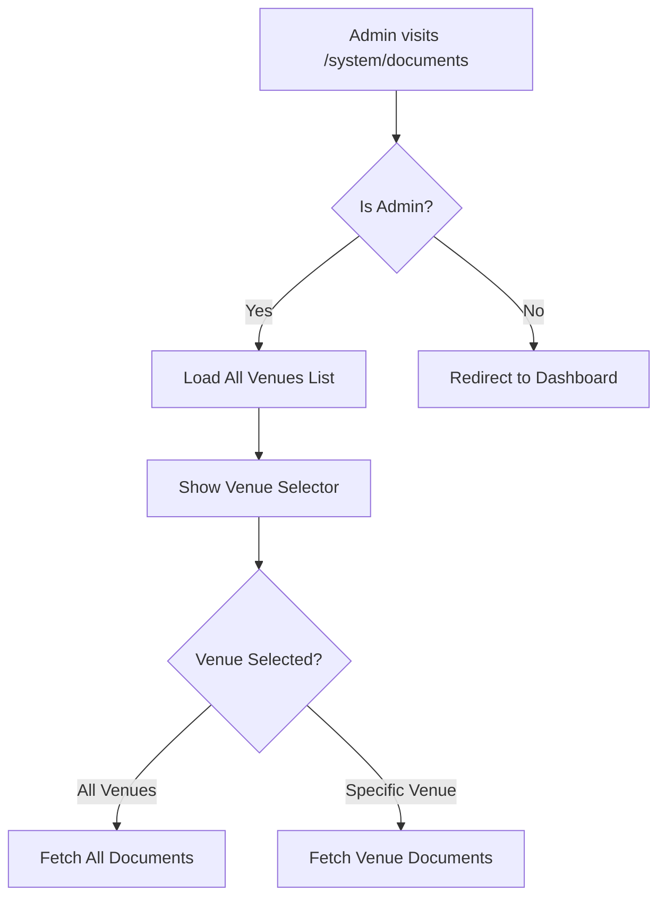
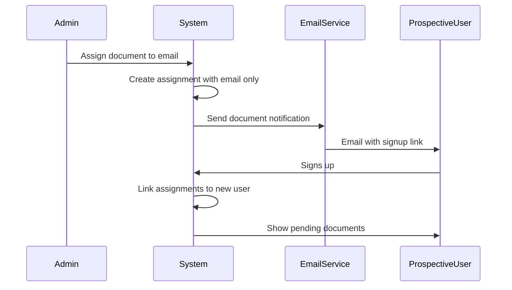
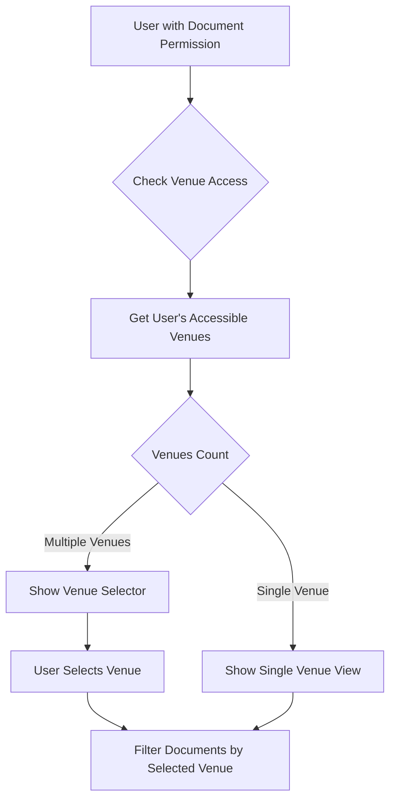

# Document Management Admin Enhancement Plan

## Overview

This plan addresses the need for admin super-user access to all documents across venues, venue filtering capabilities, and the ability to send documents to users not yet in the system.

## Current Issues

### 1. Admin Venue Restriction
**File**: [`src/app/system/documents/page.tsx`](src/app/system/documents/page.tsx:27-40)

The current implementation restricts admins to only see documents from their assigned venue:
```typescript
if (!venueId) {
  return (
    <DashboardLayout user={user}>
      <div className="text-center py-12">
        <h2>No Venue Assigned</h2>
        <p>You need to be assigned to a venue to view document analytics.</p>
      </div>
    </DashboardLayout>
  );
}
```

**Problem**: Admins should have super-user access to view ALL documents across ALL venues.

### 2. Missing Venue Filter UI
**File**: [`src/app/manage/documents/documents-manage-client.tsx`](src/app/manage/documents/documents-manage-client.tsx:22-24)

The client component receives a static `venueId` prop but has no UI to change it:
```typescript
interface DocumentsManageClientProps {
  venueId: string | null;
}
```

**Problem**: No venue selector/dropdown exists to filter documents by venue.

### 3. Cannot Send Documents to Prospective Users
**File**: [`src/lib/actions/documents/assignments.ts`](src/lib/actions/documents/assignments.ts:214-228)

The assignment creation requires an existing user:
```typescript
const targetUser = await prisma.user.findUnique({
  where: { id: data.userId },
  include: {
    venues: { where: { venueId: data.venueId } },
  },
});

if (!targetUser) {
  return { success: false, error: "User not found" };
}
```

**Problem**: Cannot assign documents to users who haven't signed up yet.

---

## Proposed Solution

### Phase 1: Admin Super-User Document Access

#### 1.1 Update Admin Documents Page
**File**: `src/app/system/documents/page.tsx`

Changes needed:
- Remove venue requirement for admins
- Add venue selector dropdown at the top
- Default to "All Venues" view for admins
- Fetch all venues for the dropdown



#### 1.2 Create Admin Documents Client Component
**New File**: `src/app/system/documents/admin-documents-client.tsx`

Features:
- Venue selector dropdown with "All Venues" option
- Documents table with venue column
- User filter across all venues
- Status filters
- Bulk actions

### Phase 2: Venue Filtering UI

#### 2.1 Venue Selector Component
**New File**: `src/components/documents/VenueSelector.tsx`

```typescript
interface VenueSelectorProps {
  venues: { id: string; name: string }[];
  selectedVenueId: string | "all";
  onVenueChange: (venueId: string | "all") => void;
  showAllOption?: boolean;
}
```

Features:
- Combobox/searchable dropdown for many venues
- "All Venues" option for admins
- Clear visual indicator of current selection

#### 2.2 Update Manager Documents View
**File**: `src/app/manage/documents/documents-manage-client.tsx`

Changes:
- Add venue selector for managers with multiple venue access
- Filter documents by selected venue
- Update stats cards based on selection

### Phase 3: Prospective User Document Assignment

#### 3.1 Database Schema Update
**File**: `prisma/schema.prisma`

The `DocumentAssignment` model already has an `invitationId` field. We need to:
- Make `userId` nullable
- Add email field for prospective users

```prisma
model DocumentAssignment {
  // ... existing fields
  userId      String?   // Made nullable
  email       String?   // New field for prospective users
  invitationId String?  // Already exists
  
  // Relations
  user        User?              @relation(...)
  invitation  UserInvitation?    @relation(...)
}
```

#### 3.2 Update Assignment Actions
**File**: `src/lib/actions/documents/assignments.ts`

New function: `createProspectiveUserAssignment`

```typescript
interface CreateProspectiveAssignmentInput {
  templateId?: string;
  bundleId?: string;
  email: string;          // Email of prospective user
  venueId: string;
  dueDate?: Date;
  notes?: string;
  sendInvitation?: boolean; // Whether to send system invitation
}
```

Flow:
1. Check if user exists with that email
2. If exists, use existing user assignment flow
3. If not exists:
   - Create assignment with email only
   - Optionally create invitation
   - Send email with document assignment notification

#### 3.3 Invitation Integration
**File**: `src/lib/actions/invites.ts`

When a user signs up via invitation:
1. Check for pending document assignments with matching email
2. Link assignments to the new user account
3. Notify user of pending documents



### Phase 4: UI Components

#### 4.1 Document Assignment Dialog
**New File**: `src/components/documents/AssignDocumentDialog.tsx`

Features:
- Tab for existing users with user picker
- Tab for prospective users with email input
- Template/bundle selector
- Venue selector
- Due date picker
- Preview of assignment

#### 4.2 Prospective Users Table
**New File**: `src/components/documents/ProspectiveUsersTable.tsx`

Shows:
- Email
- Assigned documents
- Invitation status
- Actions: Send reminder, Cancel, Convert to user

---

## Implementation Steps

### Step 1: Admin Super-User Access
1. Modify `src/app/system/documents/page.tsx` to remove venue restriction
2. Create venue selector component
3. Update analytics queries to support "all venues" mode
4. Add venue column to document tables

### Step 2: Venue Filtering
1. Create `VenueSelector` component
2. Update admin documents client to use selector
3. Update manager documents client for multi-venue managers
4. Add venue filter to all document queries

### Step 3: Prospective User Support
1. Update Prisma schema for nullable userId
2. Create migration
3. Update assignment creation logic
4. Create prospective assignment function
5. Integrate with invitation system
6. Create signup hook to link assignments

### Step 4: UI Updates
1. Create `AssignDocumentDialog` component
2. Add prospective users section to admin view
3. Update notification templates
4. Add reminder functionality

---

## Files to Modify

| File | Changes |
|------|---------|
| `src/app/system/documents/page.tsx` | Remove venue restriction, add venue selector |
| `src/app/manage/documents/page.tsx` | Add multi-venue support for managers |
| `src/lib/actions/documents/assignments.ts` | Add prospective user assignment |
| `prisma/schema.prisma` | Make userId nullable, add email field |
| `src/lib/actions/invites.ts` | Link document assignments on signup |

## New Files to Create

| File | Purpose |
|------|---------|
| `src/components/documents/VenueSelector.tsx` | Reusable venue dropdown |
| `src/components/documents/AssignDocumentDialog.tsx` | Document assignment UI |
| `src/components/documents/ProspectiveUsersTable.tsx` | Pending invitations view |
| `src/app/system/documents/admin-documents-client.tsx` | Admin-specific client component |

---

## Clarified Requirements

1. **Invitation Flow**: Prospective users will receive a system invitation email automatically when assigned a document.

2. **Permission-Based Access**: ANY user with the `documents.read` or `documents.assign` permission can access the Document View and assign documents across ALL venues they have access to (not just managers - this is permission-based, not role-based).

3. **Document Visibility**: Admins see all documents. Other users see documents based on their venue permissions.

4. **Notification Preferences**: Email notifications for document assignments.

---

## Permission-Based Venue Access

The system uses a permission-based model where users with document permissions can operate across all venues they have access to:



### Permission Checks

| Permission | Description |
|------------|-------------|
| `documents.read` | Can view documents at assigned venues |
| `documents.create` | Can create document templates at assigned venues |
| `documents.assign` | Can assign documents to users at assigned venues |
| `documents.update` | Can update document templates at assigned venues |
| `documents.delete` | Can delete document templates at assigned venues |

### Admin Super-User Override

Admins have additional capabilities:
- Can view documents across ALL venues (not just assigned ones)
- Has "All Venues" option in venue selector
- Can assign documents to users at any venue
- Can see prospective user assignments across all venues

---

## Next Steps

Implementation should proceed in the order listed below:
1. Admin super-user access
2. Venue filtering UI
3. Prospective user support
4. UI enhancements
