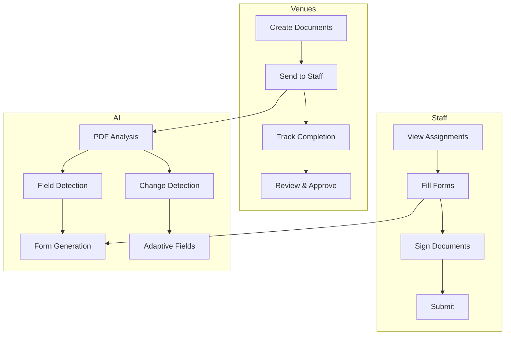
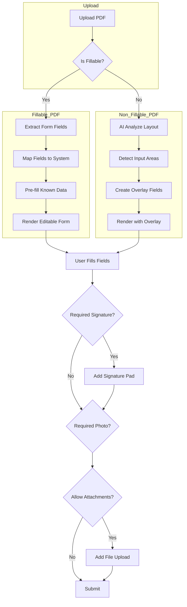
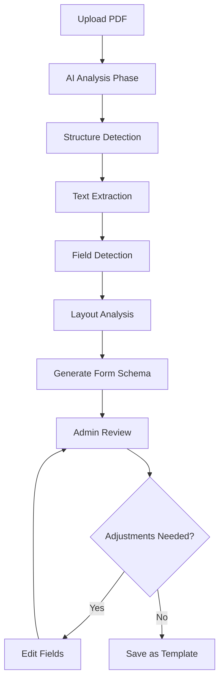
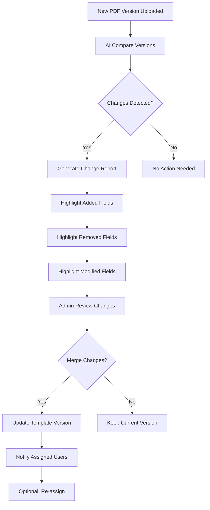
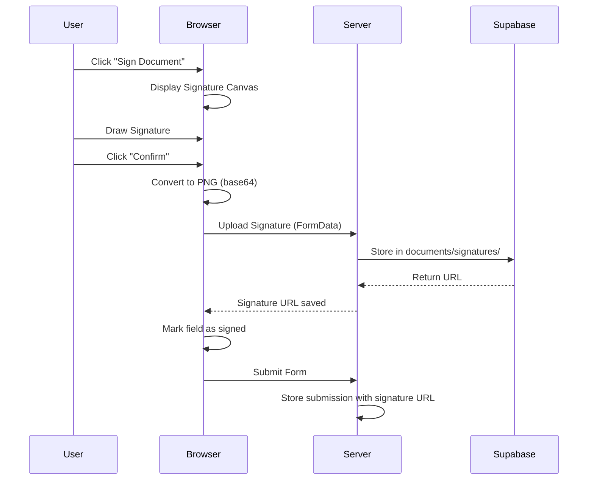
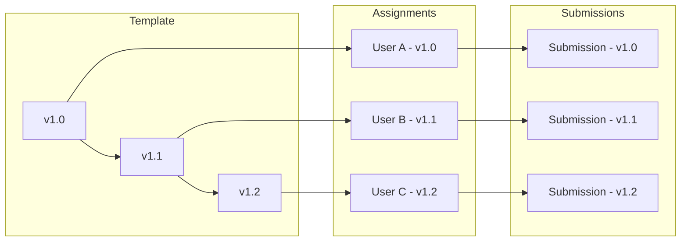
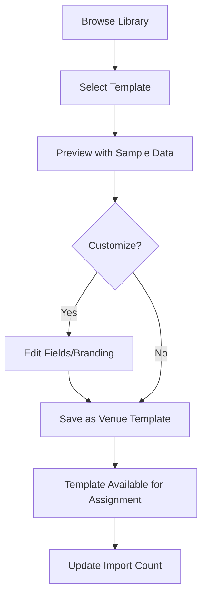
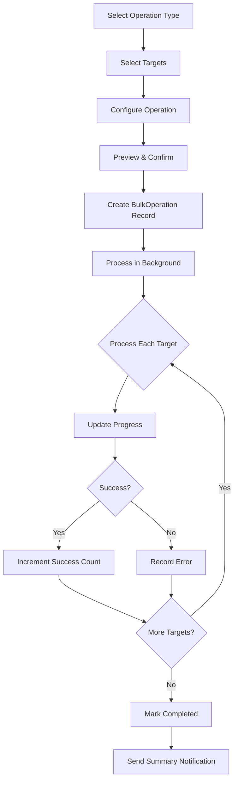

# Document Management & Onboarding System - Architecture Plan v2

## Executive Summary

This document outlines a comprehensive architecture for building an enterprise-grade Document Management and Onboarding System. The system is designed to be built entirely in-house, with AI assistance for intelligent features and Brevo for email notifications.

**Key Design Principles:**
- Build internally (no third-party PDF viewers, form builders, or signature providers)
- Use AI for intelligence (field detection, change detection, form generation)
- Enterprise-grade tracking (versions, audit trails, timestamps)
- Flexible and scalable architecture

---

## 1. System Overview

### 1.1 Core Capabilities



### 1.2 Document Types Supported

| Type | Description | Interactive | Signable | Uploadable |
|------|-------------|-------------|----------|-------------|
| **Fillable PDF** | PDF with form fields | Yes | Yes | Yes |
| **Static PDF** | Non-fillable PDF | No (overlay only) | Yes | Yes |
| **AI-Generated Form** | Form created from PDF analysis | Yes | Yes | No |
| **Manual Form** | Form built from scratch | Yes | Yes | No |
| **External Link** | Link to external resource | No | No | No |

---

## 2. Enhanced Database Schema

### 2.1 Core Models

```prisma
// ============================================================================
// DOCUMENT TEMPLATES
// ============================================================================

model DocumentTemplate {
  id              String    @id @default(cuid())
  venueId         String
  venue           Venue     @relation(fields: [venueId], references: [id])
  
  // Basic Info
  name            String
  description     String?
  category        String    @default("GENERAL") // ONBOARDING, COMPLIANCE, POLICY, GENERAL
  tags            String[] @default([])
  
  // Document Type
  documentType    DocumentType
  
  // PDF-specific (if documentType is PDF)
  pdfUrl          String?   // Stored in Supabase
  pdfFileName     String?
  pdfFileSize     Int?
  pdfVersion      Int       @default(1) // PDF file version
  
  // Form-specific (if documentType is FORM)
  formSchema      Json?     // Form field definitions
  formConfig      Json?     // Form configuration (theme, layout, etc.)
  
  // Hybrid Mode (PDF with overlay fields)
  isHybrid        Boolean   @default(false)
  overlayFields   Json?     // Field definitions for PDF overlay
  
  // Settings
  isRequired      Boolean   @default(true)
  allowDownload   Boolean   @default(true)
  requireSignature Boolean  @default(false)
  requirePhoto    Boolean   @default(false)
  allowAttachments Boolean  @default(false)
  instructions    String?   // Instructions shown to staff
  
  // Print-only mode (no interactive features)
  isPrintOnly    Boolean   @default(false)
  printInstructions String? // Special instructions for print-only
  
  // Version Control
  currentVersion  Int       @default(1)
  isActive        Boolean   @default(true)
  archivedAt      DateTime?
  
  // Timestamps
  createdAt       DateTime  @default(now())
  updatedAt       DateTime  @updatedAt
  createdBy       String
  
  // Relations
  versions        DocumentTemplateVersion[]
  assignments     DocumentAssignment[]
  bundles        DocumentBundleItem[]
  
  @@index([venueId])
  @@index([category])
  @@index([documentType])
  @@index([isActive])
}

model DocumentTemplateVersion {
  id              String    @id @default(cuid())
  templateId      String
  template        DocumentTemplate @relation(fields: [templateId], references: [id], onDelete: Cascade)
  
  version         Int
  
  // Snapshot of template at this version
  name            String
  description     String?
  category        String
  tags            String[]
  documentType    DocumentType
  pdfUrl          String?
  pdfFileName     String?
  pdfFileSize     Int?
  formSchema      Json?
  formConfig      Json?
  overlayFields   Json?
  isHybrid        Boolean
  isRequired      Boolean
  allowDownload   Boolean
  requireSignature Boolean
  requirePhoto    Boolean
  allowAttachments Boolean
  instructions    String?
  isPrintOnly    Boolean
  printInstructions String?
  
  // Change tracking
  changes         Json?     // Description of what changed from previous version
  
  createdAt       DateTime  @default(now())
  createdBy       String
  
  @@unique([templateId, version])
  @@index([templateId])
}

// ============================================================================
// DOCUMENT BUNDLES (PACKS)
// ============================================================================

model DocumentBundle {
  id              String    @id @default(cuid())
  venueId         String
  venue           Venue     @relation(fields: [venueId], references: [id])
  
  name            String
  description     String?
  category        String    @default("GENERAL")
  
  // Bundle configuration
  isRequired      Boolean   @default(true)
  allowPartialComplete Boolean @default(false) // Can complete subset of docs
  
  // Timing
  dueWithinDays   Int?     // Days from assignment when due
  reminderDays    Int[]     @default([3, 1]) // Reminder schedule
  
  // Version control
  currentVersion  Int       @default(1)
  isActive        Boolean   @default(true)
  
  createdAt       DateTime  @default(now())
  updatedAt       DateTime  @updatedAt
  createdBy       String
  
  // Relations
  items           DocumentBundleItem[]
  assignments     BundleAssignment[]
  versions        DocumentBundleVersion[]
  
  @@index([venueId])
  @@index([isActive])
}

model DocumentBundleItem {
  id              String    @id @default(cuid())
  bundleId        String
  bundle          DocumentBundle @relation(fields: [bundleId], references: [id], onDelete: Cascade)
  templateId      String
  template        DocumentTemplate @relation(fields: [templateId], references: [id])
  
  order           Int       // Display order in bundle
  isRequired      Boolean   @default(true)
  
  createdAt       DateTime  @default(now())
  
  @@unique([bundleId, templateId])
  @@index([bundleId])
  @@index([templateId])
}

model DocumentBundleVersion {
  id              String    @id @default(cuid())
  bundleId        String
  bundle          DocumentBundle @relation(fields: [bundleId], references: [id], onDelete: Cascade)
  
  version         Int
  
  // Snapshot
  name            String
  description     String?
  category        String
  isRequired      Boolean
  allowPartialComplete Boolean
  dueWithinDays   Int?
  reminderDays    Int[]
  itemsSnapshot   Json      // Snapshot of bundle items
  
  changes         Json?
  
  createdAt       DateTime  @default(now())
  
  @@unique([bundleId, version])
  @@index([bundleId])
}

// ============================================================================
// DOCUMENT ASSIGNMENTS
// ============================================================================

model DocumentAssignment {
  id              String    @id @default(cuid())
  
  // Assignment type: SINGLE or BUNDLE
  assignmentType  AssignmentType
  
  // Single document assignment
  templateId      String?
  template        DocumentTemplate? @relation(fields: [templateId], references: [id])
  
  // Bundle assignment
  bundleId        String?
  bundle          DocumentBundle? @relation(fields: [bundleId], references: [id])
  
  // User assignment
  userId          String
  user            User      @relation(fields: [userId], references: [id])
  
  // Context
  venueId         String
  venue           Venue     @relation(fields: [venueId], references: [id])
  assignedBy      String    // User who assigned
  assignedByUser  User      @relation("AssignedByUser", fields: [assignedBy], references: [id])
  
  // Via invitation (if assigned during onboarding)
  invitationId    String?
  invitation      UserInvitation? @relation(fields: [invitationId], references: [id])
  
  // Timing
  assignedAt      DateTime  @default(now())
  dueDate         DateTime?
  completedAt     DateTime?
  
  // Status
  status          AssignmentStatus @default(PENDING)
  
  // Version tracking (assignment uses template version at time of assignment)
  templateVersion Int?      // Version of template when assigned
  bundleVersion   Int?      // Version of bundle when assigned
  
  // Notes
  notes           String?
  
  // Relations
  submissions     DocumentSubmission[]
  reminders       DocumentReminder[]
  
  @@index([userId])
  @@index([templateId])
  @@index([bundleId])
  @@index([venueId])
  @@index([status])
  @@index([assignedBy])
}

// ============================================================================
// DOCUMENT SUBMISSIONS
// ============================================================================

model DocumentSubmission {
  id              String    @id @default(cuid())
  assignmentId    String
  assignment      DocumentAssignment @relation(fields: [assignmentId], references: [id], onDelete: Cascade)
  
  // Submission type matches template type
  submissionType  DocumentType
  
  // Form submission data (if form or hybrid)
  formData        Json?     // User's form responses
  
  // PDF submission data (if PDF)
  pdfUrl          String?   // Filled PDF (stored in Supabase)
  pdfFileName     String?
  pdfFileSize     Int?
  
  // Signature (if required)
  signatureUrl    String?   // Signature image (stored in Supabase)
  signedAt        DateTime?
  signatureIp    String?   // IP address when signed
  
  // Photo upload (if required)
  photoUrls       String[]  @default([])
  
  // Attachments (if allowed)
  attachmentUrls  String[]  @default([])
  attachmentNames String[] @default([])
  
  // Status
  status          SubmissionStatus @default(DRAFT)
  
  // Review
  reviewedBy      String?
  reviewedAt      DateTime?
  reviewNotes     String?
  reviewStatus    ReviewStatus? // APPROVED, REJECTED, NEEDS_REVISION
  
  // Print-only confirmation
  printConfirmed  Boolean   @default(false)
  printConfirmedAt DateTime?
  
  // Timestamps
  createdAt       DateTime  @default(now())
  updatedAt       DateTime  @updatedAt
  
  // Version (submission uses template version at time of submission)
  templateVersion Int
  
  // Relations
  fieldValues     FieldValue[]
  auditLogs       DocumentAuditLog[]
  
  @@index([assignmentId])
  @@index([status])
  @@index([reviewStatus])
}

// ============================================================================
// FIELD VALUES (for form data storage)
// ============================================================================

model FieldValue {
  id              String    @id @default(cuid())
  submissionId    String
  submission      DocumentSubmission @relation(fields: [submissionId], references: [id], onDelete: Cascade)
  
  fieldId         String    // Reference to field in formSchema
  fieldType       String    // TEXT, TEXTAREA, NUMBER, etc.
  fieldLabel      String    // Label at time of submission
  
  // Value (depends on field type)
  textValue       String?
  numberValue     Decimal?  @db.Decimal(15, 2)
  booleanValue    Boolean?
  dateValue       DateTime?
  selectValue     String?
  multiSelectValue String[] @default([])
  signatureValue  String?   // URL to signature image
  fileValue       String?   // URL to uploaded file
  
  // Metadata
  version         Int       // Template version when captured
  
  createdAt       DateTime  @default(now())
  
  @@index([submissionId])
  @@index([fieldId])
}

// ============================================================================
// DOCUMENT REMINDERS
// ============================================================================

model DocumentReminder {
  id              String    @id @default(cuid())
  assignmentId    String
  assignment      DocumentAssignment @relation(fields: [assignmentId], references: [id], onDelete: Cascade)
  
  reminderType    ReminderType // EMAIL, IN_APP, BOTH
  scheduledFor    DateTime
  sentAt          DateTime?
  status          ReminderStatus @default(PENDING)
  
  createdAt       DateTime  @default(now())
  
  @@index([assignmentId])
  @@index([status])
  @@index([scheduledFor])
}

// ============================================================================
// DOCUMENT AUDIT LOG
// ============================================================================

model DocumentAuditLog {
  id              String    @id @default(cuid())
  
  // Resource
  resourceType    ResourceType // TEMPLATE, ASSIGNMENT, SUBMISSION
  resourceId      String
  
  // Action
  action          AuditAction
  description     String?
  
  // Who
  userId          String?   // If null, system action
  user            User?     @relation(fields: [userId], references: [id])
  
  // Changes
  oldValue       Json?
  newValue       Json?
  changes         Json?     // Detailed change log
  
  // Context
  ipAddress       String?
  userAgent       String?
  
  createdAt       DateTime  @default(now())
  
  @@index([resourceType, resourceId])
  @@index([userId])
  @@index([createdAt])
}

// ============================================================================
// ENUMS
// ============================================================================

enum DocumentType {
  FORM      // Native form built in system
  PDF       // PDF document
  HYBRID    // PDF with overlay fields
  EXTERNAL  // External link
}

enum AssignmentType {
  SINGLE
  BUNDLE
}

enum AssignmentStatus {
  PENDING
  IN_PROGRESS
  SUBMITTED
  UNDER_REVIEW
  COMPLETED
  REJECTED
  EXPIRED
  WAIVED
}

enum SubmissionStatus {
  DRAFT
  SUBMITTED
  UNDER_REVIEW
  NEEDS_REVISION
  APPROVED
  REJECTED
}

enum ReviewStatus {
  APPROVED
  REJECTED
  NEEDS_REVISION
}

enum ReminderType {
  EMAIL
  IN_APP
  BOTH
}

enum ReminderStatus {
  PENDING
  SENT
  FAILED
  CANCELLED
}

enum ResourceType {
  TEMPLATE
  BUNDLE
  ASSIGNMENT
  SUBMISSION
}

enum AuditAction {
  CREATED
  UPDATED
  DELETED
  ASSIGNED
  SUBMITTED
  REVIEWED
  APPROVED
  REJECTED
  VIEWED
  DOWNLOADED
  SIGNED
  REMINDED
  WAIVED
  VERSION_CREATED
  VERSION_RESTORED
}
```

### 2.2 User Relations Update

Add to existing User model:
```prisma
model User {
  // ... existing fields ...
  
  // Document relations
  documentAssignments  DocumentAssignment[]
  documentSubmissions   DocumentSubmission[]
  documentAuditLogs     DocumentAuditLog[]
  
  // Assigned documents (for quick queries)
  assignedDocuments     DocumentAssignment[] @relation("AssignedByUser")
  
  // Waived documents
  waivedDocuments       DocumentAssignment[] @relation("WaivedDocuments")
}
```

---

## 3. PDF Processing Strategy

### 3.1 In-House PDF Rendering

**Technology Stack:**
- **PDF.js** (Mozilla) - For rendering PDFs in browser
- **pdf-lib** - For PDF manipulation and form field handling
- **React-PDF** - React wrapper for PDF.js

**File Storage Structure:**
```
document-uploads/
├── templates/
│   ├── {venueId}/
│   │   ├── {templateId}/
│   │   │   ├── {version}/
│   │   │   │   ├── original.pdf
│   │   │   │   └── current.pdf
├── submissions/
│   ├── {assignmentId}/
│   │   ├── filled.pdf
│   │   ├── signature.png
│   │   └── attachments/
└── signatures/
    └── {userId}/
        └── {signatureId}.png
```

### 3.2 PDF Handling Flow



### 3.3 PDF Field Mapping

**For Fillable PDFs:**
```typescript
interface PDFFieldMapping {
  pdfFieldName: string;      // Name in PDF
  systemFieldId: string;     // Our internal field ID
  prefillSource: PrefillSource; // Where to get prefill data
  transform?: FieldTransform; // Optional transformation
}

type PrefillSource = 
  | 'user.name' 
  | 'user.email' 
  | 'user.phone'
  | 'user.dateOfBirth'
  | 'user.addressStreet'
  | 'user.addressCity'
  | 'user.addressState'
  | 'user.addressPostcode'
  | 'venue.name'
  | 'custom'; // Custom value

interface FieldTransform {
  type: 'uppercase' | 'lowercase' | 'date_format' | 'custom';
  config?: Record<string, any>;
}
```

### 3.4 Non-Fillable PDF Overlay

**AI Detection Process:**
1. Upload static PDF
2. AI analyzes page layout and identifies potential input areas
3. AI suggests field positions (x, y coordinates on page)
4. Admin reviews and confirms/adjusts field placements
5. Fields are saved as overlay definitions

```typescript
interface PDFOverlayField {
  id: string;
  fieldType: FieldType;
  label: string;
  pageNumber: number;
  position: {
    x: number;      // Percentage (0-100) for responsiveness
    y: number;      // Percentage (0-100)
    width: number;  // Percentage
    height: number; // Percentage
  };
  validation?: FieldValidation;
  required: boolean;
  options?: SelectOption[]; // For dropdown fields
}
```

**Error Handling & Fallback:**
```typescript
interface PDFProcessingError {
  code: string;
  message: string;
  severity: 'low' | 'medium' | 'high';
  recoverable: boolean;
  suggestion?: string;
}

// Fallback strategies
const PDF_FALLBACKS = {
  fillableFieldExtraction: {
    strategy: 'manual_field_creation',
    message: 'Could not auto-extract fields. Please create fields manually.'
  },
  overlayDetectionFailed: {
    strategy: 'manual_placement',
    message: 'AI detection failed. Please place fields manually.'
  },
  largePDFHandling: {
    strategy: 'streaming_with_progressive_render',
    message: 'Large PDF detected. Using streaming mode.'
  }
};
```

---

## 4. AI-Powered Form Generation

### 4.1 PDF to Form Conversion

**Process Flow:**


### 4.2 AI Analysis Prompts

**Structure Detection Prompt:**
```
Analyze this document and identify:
1. Document type (form, contract, policy, application, etc.)
2. Logical sections and subsections
3. Required vs optional fields
4. Any legal or compliance indicators
5. Overall purpose of the document

Return a JSON structure with your analysis.
```

**Field Detection Prompt:**
```
Analyze this document for input fields. For each field identify:
1. Field label (what is field asking for)
2. Likely field type (text, number, date, checkbox, signature, etc.)
3. Position on page (approximate)
4. Validation rules (if detectable - email format, phone format, etc.)
5. Whether field seems required or optional

Also identify:
- Existing form fields (if fillable PDF)
- Tables with data
- Signature areas
- Date fields
- Checkbox groups

Return JSON with all detected fields.
```

### 4.3 Dynamic Form Schema

```typescript
interface FormSchema {
  id: string;
  version: number;
  fields: FormField[];
  settings: FormSettings;
  metadata: FormMetadata;
}

interface FormField {
  id: string;
  type: FieldType;
  label: string;
  placeholder?: string;
  description?: string;
  helpText?: string;
  required: boolean;
  validation?: FieldValidation;
  defaultValue?: any;
  options?: SelectOption[];        // For select, radio, checkbox
  conditionalLogic?: ConditionalLogic;
  appearance?: FieldAppearance;
}

type FieldType = 
  | 'text'
  | 'textarea'
  | 'number'
  | 'email'
  | 'phone'
  | 'date'
  | 'time'
  | 'datetime'
  | 'select'
  | 'multiselect'
  | 'radio'
  | 'checkbox'
  | 'toggle'
  | 'file'
  | 'image'
  | 'signature'
  | 'divider'
  | 'header'
  | 'paragraph';

interface FieldValidation {
  type: 'required' | 'min' | 'max' | 'minLength' | 'maxLength' | 
        'pattern' | 'custom' | 'email' | 'url' | 'phone';
  value?: any;
  message: string;
}

interface ConditionalLogic {
  action: 'show' | 'hide' | 'require' | 'disable';
  conditions: Condition[];
  operator: 'and' | 'or';
}

interface Condition {
  fieldId: string;
  operator: 'equals' | 'not_equals' | 'contains' | 'greater_than' | 'less_than';
  value: any;
}
```

### 4.4 Change Detection

**When PDF Updates:**


**Change Detection AI Prompt:**
```
Compare   original document with   new version and identify:

1. ADDED: Fields that exist in new but not in original
2. REMOVED: Fields that exist in original but not in new
3. MODIFIED: Fields that exist in both but have changes:
   - Label changes
   - Type changes (e.g., text to dropdown)
   - Validation rule changes
   - Position changes

For each change, provide:
- Field identifier
- Type of change
- Impact assessment (breaking, non-breaking)
- Recommendation

Return JSON with structured change report.
```

**AI Fallback Strategy:**
```typescript
interface AIFallbackConfig {
  maxRetries: number;
  timeout: number;
  fallbackToKeywordMatching: boolean;
  confidenceThreshold: number;
}

const AI_CONFIG: AIFallbackConfig = {
  maxRetries: 3,
  timeout: 30000, // 30 seconds
  fallbackToKeywordMatching: true,
  confidenceThreshold: 0.7
};
```

---

## 5. Signature Capture System

### 5.1 In-House Signature Implementation

**Technology:**
- **react-signature-canvas** - Canvas-based signature capture
- **Signature stored as PNG** - Base64 encoded, stored in Supabase

### 5.2 Signature Flow



### 5.3 Signature Security

```typescript
interface SignatureData {
  imageUrl: string;
  signedAt: DateTime;
  ipAddress: string;
  userAgent: string;
  documentTitle: string;
  // For verification
  signatureHash: string;  // Hash of signature image
  auditTrail: {
    timestamp: DateTime;
    action: 'created' | 'viewed' | 'modified';
    ipAddress: string;
  }[];
}

interface SignatureVerification {
  isValid: boolean;
  tampered: boolean;
  verifiedAt: DateTime;
  verificationMethod: 'hash' | 'visual' | 'combined';
}
```

**Signature Canvas Configuration:**
```typescript
interface SignatureCanvasConfig {
  width: number;
  height: number;
  backgroundColor: string;
  penColor: string;
  penWidth: number;
  minWidth: number;
  maxWidth: number;
  velocityFilterWeight: number;
}

const DEFAULT_SIGNATURE_CONFIG: SignatureCanvasConfig = {
  width: 600,
  height: 200,
  backgroundColor: '#ffffff',
  penColor: '#000000',
  penWidth: 2,
  minWidth: 0.5,
  maxWidth: 2.5,
  velocityFilterWeight: 0.7
};
```

---

## 6. Document Version Control

### 6.1 Version Strategy

**Key Principles:**
1. **Immutable Submissions**: Once submitted, a submission is never modified
2. **Template Versions**: Templates can evolve, but old assignments use version at assignment time
3. **Full Snapshots**: Each version stores complete state (not diffs)
4. **Version Promotion**: Moving from draft to published creates new version
5. **Version Comparison**: Side-by-side diff view for versions



### 6.2 Version Restoration

Administrators can:
1. View any previous version of a template
2. Compare versions side-by-side
3. Restore previous versions (creates new version)
4. Assign old versions to new users

**Version Diff Types:**
```typescript
interface VersionDiff {
  versionA: number;
  versionB: number;
  changes: VersionChange[];
  summary: {
    added: number;
    removed: number;
    modified: number;
    breaking: boolean;
  };
}

interface VersionChange {
  fieldId: string;
  fieldName: string;
  changeType: 'added' | 'removed' | 'modified';
  oldValue?: any;
  newValue?: any;
  impact: 'breaking' | 'non-breaking' | 'neutral';
}
```

---

## 7. Enterprise Audit Trail

### 7.1 Tracked Actions

| Category | Actions |
|----------|---------|
| **Template** | Created, Updated, Deleted, VersionCreated, VersionRestored, Published, Archived |
| **Bundle** | Created, Updated, Deleted, ItemsAdded, ItemsRemoved |
| **Assignment** | Created, Viewed, Started, Submitted, ReminderSent, Waived, Expired |
| **Submission** | Created, Updated, Submitted, Reviewed, Approved, Rejected, Downloaded |
| **Signature** | Requested, Captured, Viewed |
| **Fields** | Viewed, Modified, RequiredChanged |

### 7.2 Audit Log Schema

```typescript
interface AuditLogEntry {
  id: string;
  timestamp: DateTime;
  
  // What
  resourceType: 'TEMPLATE' | 'BUNDLE' | 'ASSIGNMENT' | 'SUBMISSION';
  resourceId: string;
  resourceName: string;  // Human-readable name
  
  // Action
  action: string;
  description: string;
  
  // Who
  userId?: string;
  userName?: string;
  userEmail?: string;
  ipAddress?: string;
  userAgent?: string;
  
  // Changes (for updates)
  changes?: {
    field: string;
    oldValue: any;
    newValue: any;
  }[];
  
  // Context
  venueId?: string;
  metadata?: Record<string, any>;
}
```

### 7.3 Audit Log Views

**For Venues (Admin Dashboard):**
- Filter by date range
- Filter by action type
- Filter by user
- Filter by document/bundle
- Export to CSV

**For Staff (My Documents):**
- View history of their own submissions
- See who viewed/reviewed their documents
- Download submission receipts

**Audit Log Retention:**
```typescript
interface AuditLogRetention {
  retentionPeriodDays: number;  // Default 365 days
  archiveAfterDays: number;  // Archive after 90 days
  deleteAfterDays: number;  // Hard delete after 730 days
}
```

---

## 8. User Interfaces

### 8.1 Venue Documents Dashboard

**Route:** `/system/documents`

**Features:**
- Document templates list with search/filter
- Create new document wizard
- Document analytics (completion rates, pending, overdue)
- Quick actions (edit, duplicate, archive, delete)
- Version history access
- Bundle management

**Analytics Display:**
```
┌───────────────────────────────────────────────────────────────────┐
│  Document Analytics           [Date Range Picker]          │
├─────────────────────────────────────────────────────────────────────┤
│  ┌──────────┐  ┌──────────┐  ┌──────────┐  ┌──────────┐  ┌──────────┐  │
│  │ Total    │  Completed│  │ Pending  │  │ Overdue  │  │
│  │   156   │  │   89%    │  │    23    │  │    5     │  │
│  └──────────┘  └──────────┘  └──────────┘  └──────────┘  └──────────┘  │
├─────────────────────────────────────────────────────────────────────┤
│  Documents Table                                           │
│  ┌─────────────────────────────────────────────────────────────┐   │
│  │ Name        │ Category │ Assigned │ Completion │ Act │   │
│  ├─────────────────────────────────────────────────────────────┤   │
│  │ Name        │ Category │ Assigned │ Completion │ Act │   │
│  ├─────────────────────────────────────────────────────────────┤   │
│  │ WHS Form    │ Complian │   45     │    93%    │ ⋯  │   │
│  │ NDA         │ Policy   │   30     │   100%    │ ⋯  │   │
│  │ Onboarding  │ Onboard  │   25     │    80%    │ ⋯  │   │
│  └─────────────────────────────────────────────────────────────┘   │
```

### 8.2 Document Editor (Venue)

**Route:** `/system/documents/[id]/edit`

**Tabs:**
1. **Settings** - Name, description, category, tags
2. **Build** - Form builder or PDF upload
3. **Fields** - Field configuration
4. **Preview** - Live preview
5. **Assignments** - Who has this document
6. **Analytics** - Completion stats
7. **History** - Version history

**Form Builder Interface:**
```
┌─────────────────────────────────────────────────────────────────────┐
│  Form Builder                              [Preview] [Save] │
├─────────────────────────────────────────────────────────────────────┤
│  ┌──────────┐  ┌─────────────────────────────────────────────────────┐  │
│  │ FIELD TYPES   │  │  FORM CANVAS                        │  │
│  │              │  │                                     │  │
│  │ [Text]       │  │  Header: Personal Details            │  │
│  │ [Textarea]   │  │  ──────────────────────────────────────┤   │
│  │ [Number]     │  │  Full Name *                         │  │
│  │ [Email]      │  │  [                                 ]│  │
│  │ [Phone]      │  │  ──────────────────────────────────────┤   │
│  │ [Date]       │  │  Email Address *                     │  │
│  │ [Select]     │  │  [                                 ]│  │
│  │ [Checkbox]   │  │  Signature *                         │  │
│  │ [Radio]      │  │  [Draw Signature          ]           │  │
│  │ [File]       │  │  [Draw Signature          ]           │  │
│  │ [Image]      │  │  ──────────────────────────────────────┤   │
│  │ [Signature]  │  │  ──────────────────────────────────────┤   │
│  │ [Header]     │  │  ──────────────────────────────────────┤   │
│  │ [Paragraph]  │  │  ──────────────────────────────────────┤   │
│  │ [Divider]    │  │  ──────────────────────────────────────┘   │
└─────────────────────────────────────────────────────────────┘
```

### 8.3 Staff Document Dashboard

**Route:** `/my/documents`

**Tabs:**
1. **Pending** - Documents waiting to be completed
2. **Completed** - Successfully submitted documents
3. **Under Review** - Submitted, awaiting review
4. **Rejected** - Need revisions

**Pending Document Card:**
```
┌─────────────────────────────────────────────────────────────┐
│  ┌─────────────────────────────────────────────────────────────┐    │
│  │ 📄 WHS Safety Form                               │    │
│  │ Category: Compliance • Due: Jan 15, 2025      │    │
│  │                                                  │    │
│  │  📋 5 fields to complete                        │    │
│  │ ✍️ Signature required                          │    │
│  │                                                  │    │
│  │ [        Start Form        ]                   │    │
│  └─────────────────────────────────────────────────────────────┘    │
```

### 8.4 Document Completion Interface

**Route:** `/my/documents/[assignmentId]/complete`

**Features:**
- Progress indicator
- Section navigation (if multi-section)
- Field validation (inline errors)
- Auto-save drafts (every 30 seconds)
- Photo capture (if required)
- Signature pad (if required)
- File upload (if allowed)
- Print confirmation (if print-only)
- Review before submit

**Auto-save Configuration:**
```typescript
interface AutoSaveConfig {
  interval: number;        // Save every X milliseconds
  maxDraftAge: number;    // Delete drafts older than X days
  storageKey: string;     // LocalStorage key
}

const DEFAULT_AUTOSAVE: AutoSaveConfig = {
  interval: 30000,  // 30 seconds
  maxDraftAge: 7,      // 7 days
  storageKey: 'document_drafts'
};
```

---

## 9. Email Notifications (Brevo)

### 9.1 Notification Types

| Event | Recipient | Template |
|-------|-----------|----------|
| Document Assigned | Staff | DocumentAssigned |
| Document Due Soon | Staff | DocumentDueSoon |
| Document Overdue | Staff + Manager | DocumentOverdue |
| Document Submitted | Staff + Manager | DocumentSubmitted |
| Document Approved | Staff | DocumentApproved |
| Document Rejected | Staff | DocumentRejected |
| Document Waived | Staff | DocumentWaived |
| Signature Required | Staff | SignatureRequired |

### 9.2 Email Template Variables

```typescript
interface DocumentEmailVariables {
  // Recipient
  recipientName: string;
  recipientEmail: string;
  
  // Document
  documentName: string;
  documentDescription?: string;
  documentCategory: string;
  
  // Venue
  venueName: string;
  
  // Assignment
  assignedBy: string;
  assignedAt: Date;
  dueDate?: Date;
  
  // Action
  actionUrl: string;
  daysRemaining?: number;
  
  // Submission (for status emails)
  submittedAt?: Date;
  reviewedBy?: string;
  reviewNotes?: string;
}
```

**Email Template Implementation:**
```typescript
// Extend existing templates.ts with document-specific templates

export function getDocumentEmailTemplate(
  type: DocumentEmailType,
  variables: DocumentEmailVariables
): EmailTemplate {
  const { recipientName, documentName, actionUrl, ... } = variables;
  
  // Use existing escapeHtml for XSS protection
  const safeRecipientName = escapeHtml(recipientName);
  const safeDocumentName = escapeHtml(documentName);
  
  // Return appropriate template based on type
  switch (type) {
    case 'DocumentAssigned':
      return {
        subject: `📄 New Document Assignment: ${safeDocumentName}`,
        htmlContent: createDocumentTemplate('assignment', variables)
      };
    // ... other cases
  }
}
```

---

## 10. Implementation Phases

### Phase 1: Foundation (Weeks 1-2)
- [ ] Enhanced database schema migration
- [ ] Supabase storage bucket setup (`document-uploads`)
- [ ] RBAC permissions for documents
- [ ] Basic CRUD for document templates
- [ ] Basic assignment system

**Deliverables:**
- Database migration script
- Storage bucket with RLS policies
- Permission seeding script
- Document templates CRUD actions
- Assignment creation actions

### Phase 2: Form Builder (Weeks 3-4)
- [ ] Manual form builder UI
- [ ] Field types implementation
- [ ] Form validation logic
- [ ] Form rendering engine
- [ ] Draft auto-save

**Deliverables:**
- Form builder component with drag-and-drop
- 15+ field type components
- Validation engine with custom rules
- Form renderer with conditional logic
- Auto-save service with local storage

### Phase 3: PDF Integration (Weeks 5-6)
- [ ] PDF upload and storage
- [ ] PDF.js integration for rendering
- [ ] Fillable PDF field extraction
- [ ] PDF field pre-population
- [ ] Filled PDF generation

**Deliverables:**
- PDF upload component with progress tracking
- PDF.js integration service
- Fillable field extraction service
- PDF field mapping system
- Filled PDF generation with pdf-lib

### Phase 4: AI Features (Weeks 7-8)
- [ ] AI form generation from PDF
- [ ] Field detection service
- [ ] Change detection system
- [ ] Adaptive form updates
- [ ] Overlay field creation for static PDFs

**Deliverables:**
- AI field detection service with OpenAI integration
- Change detection service
- Form schema generator
- Overlay field placement UI
- AI fallback strategies

### Phase 5: Signatures & Uploads (Weeks 9-10)
- [ ] Signature pad implementation
- [ ] Photo capture integration
- [ ] File attachment handling
- [ ] Print-only confirmation flow

**Deliverables:**
- Signature canvas component
- Photo capture component (camera + file upload)
- File attachment manager
- Print-only document handler
- Signature storage service

### Phase 6: Bundles & Workflows (Weeks 11-12)
- [ ] Document bundle creation
- [ ] Bundle assignment
- [ ] Reminder system
- [ ] Due date tracking
- [ ] Bulk operations framework

**Deliverables:**
- Bundle creation wizard
- Bundle assignment flow
- Reminder scheduling service
- Due date tracking system
- Bundle analytics
- Bulk operation processor with background jobs

### Phase 6.5: Template Library (Week 13)
- [ ] Template library database schema
- [ ] Library browser UI
- [ ] Template import flow
- [ ] Pre-seed common templates
- [ ] Usage tracking

**Deliverables:**
- Template library models and migrations
- Library browser with search/filter
- One-click import functionality
- 20+ pre-built templates for AU/NZ
- Import tracking and analytics

### Phase 7: Analytics & Reporting (Weeks 13-14)
- [ ] Completion analytics
- [ ] Audit log system
- [ ] Export capabilities
- [ ] Dashboard widgets

**Deliverables:**
- Completion analytics dashboard
- Audit log viewer
- CSV export functionality
- Dashboard widgets for documents

### Phase 8: Polish & Testing (Weeks 15-16)
- [ ] User acceptance testing
- [ ] Performance optimization
- [ ] Security review
- [ ] Documentation
- [ ] Training materials

**Deliverables:**
- User testing report
- Performance benchmarks
- Security audit report
- API documentation
- Admin training guide

---

## 11. Template Library

### 11.1 Overview

A curated library of pre-built document templates that venues can import and customize, reducing setup time and ensuring compliance with common requirements.

### 11.2 Template Categories

| Category | Examples | Jurisdiction |
|----------|----------|--------------|
| **Onboarding** | Employment contracts, TFN declarations, bank details forms | AU/NZ |
| **Compliance** | WHS acknowledgments, code of conduct, privacy agreements | General |
| **Certifications** | RSA certificates, gaming licenses, food safety | AU State-specific |
| **HR Policies** | Leave policies, dress code, social media policy | General |
| **Contracts** | NDAs, employment agreements, contractor agreements | AU/NZ/US/UK |

### 11.3 Database Schema

```prisma
model TemplateLibraryItem {
  id              String    @id @default(cuid())
  
  // Basic Info
  name            String
  description     String?
  category        String    // ONBOARDING, COMPLIANCE, CERTIFICATION, HR, CONTRACT
  tags            String[]  @default([])
  
  // Jurisdiction
  jurisdiction    String    @default("GENERAL") // AU, NZ, US, UK, GENERAL
  stateSpecific   String?   // NSW, VIC, QLD, etc. for AU state-specific forms
  
  // Document
  documentType    DocumentType
  pdfUrl          String?   // Original PDF stored in Supabase
  formSchema      Json?     // Pre-mapped form fields
  formConfig      Json?     // Form configuration
  
  // Metadata
  version         Int       @default(1)
  isActive        Boolean   @default(true)
  isOfficial      Boolean   @default(false) // Official government forms
  
  // Usage Tracking
  importCount     Int       @default(0)
  popularity      Float     @default(0) // Calculated score
  
  // Timestamps
  createdAt       DateTime  @default(now())
  updatedAt       DateTime  @updatedAt
  
  // Relations
  imports         TemplateLibraryImport[]
  
  @@index([category])
  @@index([jurisdiction])
  @@index([isActive])
  @@index([popularity])
}

model TemplateLibraryImport {
  id              String    @id @default(cuid())
  
  libraryItemId   String
  libraryItem     TemplateLibraryItem @relation(fields: [libraryItemId], references: [id])
  
  venueId         String
  venue           Venue     @relation(fields: [venueId], references: [id])
  
  // Created template
  templateId      String    // ID of the created DocumentTemplate
  
  // Customization
  customized      Boolean   @default(false) // Whether venue modified after import
  
  importedAt      DateTime  @default(now())
  importedBy      String
  
  @@index([libraryItemId])
  @@index([venueId])
}
```

### 11.4 Template Library UI

**Route:** `/system/documents/library`

**Features:**
- Browse by category or search
- Filter by jurisdiction/state
- Preview with sample data
- One-click import to venue
- Import history tracking

**Library Browser Interface:**
```
┌─────────────────────────────────────────────────────────────────────┐
│  Template Library                    [Search...] [Filter ▼]  │
├─────────────────────────────────────────────────────────────────────┤
│  Categories: [All] [Onboarding] [Compliance] [HR] [Contracts]       │
│  Jurisdiction: [All] [AU] [NZ] [US] [UK] [General]                  │
├─────────────────────────────────────────────────────────────────────┤
│  ┌─────────────────────────────────────────────────────────────┐    │
│  │ 📄 TFN Declaration Form                          [Preview] │    │
│  │ AU • Tax • Official ATO Form                                │    │
│  │ Imported 234 times • ⭐ Popular                              │    │
│  │ [Import to Venue]                                           │    │
│  └─────────────────────────────────────────────────────────────┘    │
│  ┌─────────────────────────────────────────────────────────────┐    │
│  │ 📄 WHS Safety Acknowledgment                     [Preview] │    │
│  │ AU • Compliance • NSW Specific                               │    │
│  │ Imported 156 times                                           │    │
│  │ [Import to Venue]                                           │    │
│  └─────────────────────────────────────────────────────────────┘    │
└─────────────────────────────────────────────────────────────────────┘
```

### 11.5 Import Flow



---

## 12. Bulk Operations

### 12.1 Overview

Efficiently manage large-scale document operations including bulk assignment, reminders, status updates, and reporting.

### 12.2 Bulk Operation Types

| Operation | Description | Use Case |
|-----------|-------------|----------|
| **Bulk Assign** | Assign documents to multiple users | Onboarding new staff cohort |
| **Bulk Remind** | Send reminders to pending assignments | End-of-month compliance push |
| **Bulk Approve** | Approve multiple submissions | Processing completed documents |
| **Bulk Reject** | Reject with common reason | Incomplete submissions |
| **Bulk Waive** | Waive multiple assignments | Staff no longer need document |
| **Bulk Extend** | Extend due dates | Deadline adjustment |

### 12.3 Database Schema

```prisma
model BulkOperation {
  id              String    @id @default(cuid())
  
  // Operation Type
  type            BulkOperationType
  status          BulkOperationStatus @default(PENDING)
  
  // Target
  targetType      BulkTargetType // USERS, ASSIGNMENTS, SUBMISSIONS
  targetIds       String[]  // IDs of targeted entities
  targetFilters   Json?     // Filter criteria used
  
  // Operation Data
  operationData   Json?     // Data for the operation (due date, message, etc.)
  
  // Progress
  totalCount      Int       @default(0)
  processedCount  Int       @default(0)
  successCount    Int       @default(0)
  failedCount     Int       @default(0)
  
  // Results
  results         Json?     // Detailed results per item
  errors          Json?     // Error messages
  
  // Context
  venueId         String
  venue           Venue     @relation(fields: [venueId], references: [id])
  
  // Audit
  createdBy       String
  createdByName   String    // Denormalized for display
  createdAt       DateTime  @default(now())
  startedAt       DateTime?
  completedAt     DateTime?
  
  @@index([venueId])
  @@index([type])
  @@index([status])
  @@index([createdBy])
}

enum BulkOperationType {
  ASSIGN
  REMIND
  APPROVE
  REJECT
  WAIVE
  EXTEND
  DELETE
}

enum BulkOperationStatus {
  PENDING
  PROCESSING
  COMPLETED
  PARTIALLY_COMPLETED
  FAILED
  CANCELLED
}

enum BulkTargetType {
  USERS
  ASSIGNMENTS
  SUBMISSIONS
  TEMPLATES
}
```

### 12.4 Bulk Operations UI

**Bulk Assign Dialog:**
```
┌─────────────────────────────────────────────────────────────────────┐
│  Bulk Assign Documents                                        [X]  │
├─────────────────────────────────────────────────────────────────────┤
│                                                                      │
│  Select Users                                                        │
│  ┌─────────────────────────────────────────────────────────────┐    │
│  │ [x] All Staff (45)                                          │    │
│  │ [x] Bartenders (12)                                         │    │
│  │ [ ] Managers (5)                                            │    │
│  │ [ ] Kitchen Staff (15)                                      │    │
│  │ [ ] Security (8)                                            │    │
│  └─────────────────────────────────────────────────────────────┘    │
│                                                                      │
│  Select Documents                                                    │
│  ┌─────────────────────────────────────────────────────────────┐    │
│  │ [x] WHS Safety Form                                         │    │
│  │ [x] Code of Conduct                                         │    │
│  │ [ ] RSA Certificate                                         │    │
│  └─────────────────────────────────────────────────────────────┘    │
│                                                                      │
│  Assignment Settings                                                 │
│  ┌─────────────────────────────────────────────────────────────┐    │
│  │ Due Date:     [Feb 28, 2025 📅]                             │    │
│  │ Send Email:   [x] Notify users immediately                  │    │
│  │ Notes:        [New compliance requirements for 2025]        │    │
│  └─────────────────────────────────────────────────────────────┘    │
│                                                                      │
│  Summary: Assign 2 documents to 12 users (24 assignments)            │
│                                                                      │
│  [Cancel]                              [Assign All]                  │
└─────────────────────────────────────────────────────────────────────┘
```

**Bulk Operations Progress:**
```
┌─────────────────────────────────────────────────────────────────────┐
│  Bulk Operation Progress                                             │
├─────────────────────────────────────────────────────────────────────┤
│  Assigning WHS Safety Form to 45 users...                           │
│  ████████████████████░░░░░░░░░░ 67% (30/45)                        │
│                                                                      │
│  ✓ John Smith - Assigned                                            │
│  ✓ Sarah Johnson - Assigned                                         │
│  ✗ Mike Brown - Error: User inactive                                │
│  ...                                                                 │
└─────────────────────────────────────────────────────────────────────┘
```

### 12.5 Bulk Operations Flow



### 12.6 Background Processing

```typescript
interface BulkOperationProcessor {
  // Process operation in batches
  batchSize: number;        // 10 items per batch
  delayBetweenBatches: number;  // 100ms delay
  
  // Rate limiting
  maxConcurrentOperations: number;  // 3 concurrent bulk ops per venue
  
  // Retry logic
  retryFailedItems: boolean;
  maxRetries: number;
}

const BULK_CONFIG: BulkOperationProcessor = {
  batchSize: 10,
  delayBetweenBatches: 100,
  maxConcurrentOperations: 3,
  retryFailedItems: true,
  maxRetries: 2
};
```

---

## 13. Additional Features to Consider

### 11.1 Suggested Features

| Feature | Description | Priority |
|---------|-------------|----------|
| **Conditional Forms** | Show/hide fields based on previous answers | High |
| **Document Expiry** | Auto-expire documents after set period | Medium |
| **Approval Workflow** | Multi-level approval for submissions | Medium |
| **Bulk Assignment** | Assign to multiple users at once | High |
| **Deadline Enforcement** | Block access after due date | Medium |
| **Mobile Optimization** | Mobile-friendly form completion | High |
| **Offline Mode** | Complete forms without internet | Low |
| **Integration API** | Webhook for external systems | Low |

### 11.2 Conditional Form Example

```typescript
interface ConditionalLogicExample {
  fieldId: "emergencyContactSameAsAbove";
  conditions: [
    {
      fieldId: "hasEmergencyContact";
      operator: "equals";
      value: true;
    }
  ];
  action: "show"; // Show emergency contact fields
}

// Fields configuration
const formFields = [
  {
    id: "hasEmergencyContact",
    type: "radio",
    label: "Do you have an emergency contact?",
    options: [
      { value: true, label: "Yes" },
      { value: false, label: "No" }
    ]
  },
  {
    id: "emergencyContactName",
    type: "text",
    label: "Emergency Contact Name",
    conditionalLogic: {
      action: "show",
      conditions: [{ fieldId: "hasEmergencyContact", operator: "equals", value: true }],
      operator: "and"
    }
  }
];
```

---

## 12. Technical Considerations

### 12.1 Performance

- **Large PDF handling**: Use streaming for PDFs > 5MB
- **Form rendering**: Virtualize long forms (react-window or react-virtual)
- **Image optimization**: Compress uploaded images client-side before upload (max 2MB)
- **Caching**: Cache form schemas and templates (Redis/Upstash in production)
- **Pagination**: Server-side pagination for all list views

**Performance Targets:**
```typescript
interface PerformanceTargets {
  pageLoadTime: number;        // < 2s for document list
  formRenderTime: number;       // < 500ms for form load
  pdfRenderTime: number;        // <1s for PDF load
  apiResponseTime: number;       // <200ms for most actions
  maxConcurrentUploads: number;  // 5 concurrent uploads
}
```

### 12.2 Security

- **File scanning**: Scan uploaded PDFs for malware (ClamAV or similar)
- **Signature verification**: Hash signatures for tamper detection
- **Access control**: Row-level security on document assignments
- **Audit logging**: All actions logged immutably
- **Rate limiting**: Prevent form spam submissions
- **XSS protection**: All user content escaped before rendering

**Security Measures:**
```typescript
interface SecurityConfig {
  maxFileSize: number;           // 10MB for PDFs, 2MB for images
  allowedFileTypes: string[];    // ['.pdf', '.png', '.jpg', '.jpeg']
  maxSignatureAge: number;        // Signatures expire after 1 year
  auditLogRetention: number;      // Keep logs for 1 year
  maxLoginAttempts: number;        // Rate limit login attempts
}

const SECURITY_CONFIG: SecurityConfig = {
  maxFileSize: 10 * 1024 * 1024,  // 10MB
  allowedFileTypes: ['.pdf', '.png', '.jpg', '.jpeg'],
  maxSignatureAge: 365 * 24 * 60 * 60 * 1000,  // 1 year
  auditLogRetention: 365 * 24 * 60 * 60 * 1000,  // 1 year
  maxLoginAttempts: 5
};
```

### 12.3 Scalability

- **Database**: Indexes on frequently queried fields
- **Storage**: Supabase Storage with CDN for static assets
- **Rate limiting**: Prevent form spam submissions
- **Queue system**: Background job processing for heavy operations

**Scalability Architecture:**
```typescript
interface ScalabilityConfig {
  database: {
    connectionPoolSize: number;     // 10 connections
    queryTimeout: number;           // 30s timeout
    slowQueryThreshold: number;   // Log queries >1s
  };
  storage: {
    cdnEnabled: boolean;           // Use CDN for static assets
    cacheControl: string;          // Cache for 1 hour
    maxFileSize: number;           // 10MB per file
  };
  queue: {
    maxConcurrentJobs: number;     // 10 concurrent jobs
    jobTimeout: number;           // 5 minute timeout
    retryAttempts: number;          // 3 retry attempts
  };
}

const SCALABILITY_CONFIG: ScalabilityConfig = {
  database: {
    connectionPoolSize: 10,
    queryTimeout: 30000,
    slowQueryThreshold: 1000
  },
  storage: {
    cdnEnabled: true,
    cacheControl: 'public, max-age=3600',
    maxFileSize: 10 * 1024 * 1024
  },
  queue: {
    maxConcurrentJobs: 10,
    jobTimeout: 300000,
    retryAttempts: 3
  }
};
```

---

## 13. Summary

This architecture provides a comprehensive, enterprise-grade document management system that:

1. **Eliminates third-party dependencies** for core functionality
2. **Leverages AI** for intelligent features (field detection, form generation, change tracking)
3. **Maintains data integrity** through versioning and immutable submissions
4. **Provides complete visibility** through audit trails
5. **Delivers excellent UX** through modern, responsive interfaces
6. **Integrates seamlessly** with existing Brevo email infrastructure

**Key Architectural Decisions:**

| Decision | Rationale |
|----------|-----------|
| Build in-house | Full control, no vendor lock-in, customizable |
| AI for intelligence | Smart features without external services |
| Versioned templates | Backward compatibility, immutable submissions |
| Full audit trail | Compliance, debugging, accountability |
| Phased implementation | Incremental delivery, feedback integration |
| Performance-first | Fast load times, optimized rendering |
| Security by design | XSS protection, rate limiting, access control |

**Next Steps:**
1. Review and approve architecture
2. Set up development environment
3. Begin Phase 1: Foundation
4. Follow phased implementation plan
5. Gather feedback and iterate

---

*Document Version: 2.0*
*Created: February 2025*
*Last Updated: February 2025*
