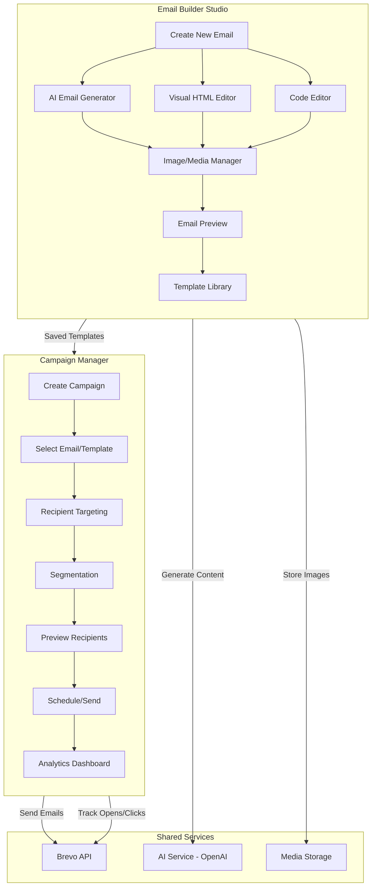

# Email System Redesign - Separated Architecture

## Overview

The current implementation combines email building with campaign sending in a single wizard. This redesign separates them into two distinct modules:

1. **Email Builder Studio** - Create, design, and store email templates
2. **Campaign Manager** - Target recipients, schedule, and send emails

---

## Architecture Diagram



---

## Module 1: Email Builder Studio

### Purpose
A dedicated workspace for creating beautiful, responsive emails with AI assistance. Think of it like a simplified Mailchimp email designer.

### Features

#### 1.1 AI Email Generator
- **Full Email Generation**: Describe the email you want, AI generates complete HTML
- **Tone Selection**: Professional, Friendly, Urgent, Celebratory, Informational
- **Style Selection**: Newsletter, Announcement, Notification, Invitation, Alert
- **Auto-classification**: AI determines if email is Marketing or Transactional
- **Iterative Refinement**: Ask AI to improve specific sections

#### 1.2 Visual Email Editor
- **Drag-and-Drop Blocks**: Headers, text, images, buttons, dividers, spacers
- **Pre-built Layouts**: 1-column, 2-column, sidebar layouts
- **Style Controls**: Fonts, colors, spacing, alignment
- **Responsive Preview**: Desktop and mobile views
- **Variable Insertion**: {{userName}}, {{venueName}}, etc.

#### 1.3 HTML Code Editor
- **Full HTML Access**: For advanced users
- **Live Preview**: See changes in real-time
- **Syntax Highlighting**: Code-friendly editor
- **Inline CSS Support**: Email-compatible styling
- **Template Variables**: Insert merge tags

#### 1.4 Media Manager
- **Image Upload**: Drag and drop images
- **GIF Support**: Embed animated GIFs
- **Image Library**: Reuse uploaded images
- **External URLs**: Link to externally hosted images
- **Alt Text**: Accessibility support

#### 1.5 Template Library
- **System Templates**: Pre-built professional templates
- **Custom Templates**: Save your emails as reusable templates
- **Categories**: Newsletter, Announcement, Notification, Marketing
- **Template Variables**: Define what variables a template uses
- **Import/Export**: Share templates between venues

### Email Builder UI Flow

```
┌─────────────────────────────────────────────────────────────────────┐
│  Email Builder Studio                                    [+ New Email] │
├─────────────────────────────────────────────────────────────────────┤
│                                                                     │
│  ┌─────────────────────────────────────────────────────────────┐   │
│  │  🔍 Search templates...                    [Filter: All ▼]  │   │
│  └─────────────────────────────────────────────────────────────┘   │
│                                                                     │
│  ┌─── AI Generated ───┐  ┌─── My Templates ───┐  ┌─── System ───┐  │
│  │                     │  │                     │  │               │  │
│  │  [Newsletter #1]   │  │  [Welcome Email]   │  │  [Announcement]│  │
│  │  [Promo Email]     │  │  [Shift Reminder]  │  │  [Notification]│  │
│  │  [+ Generate New]  │  │  [+ Create New]    │  │  [Invitation]  │  │
│  │                     │  │                     │  │               │  │
│  └─────────────────────┘  └─────────────────────┘  └───────────────┘  │
│                                                                     │
└─────────────────────────────────────────────────────────────────────┘
```

### Email Editor Interface

```
┌─────────────────────────────────────────────────────────────────────┐
│  ← Back to Studio     Editing: "March Newsletter"     [Save] [Preview]│
├─────────────────────────────────────────────────────────────────────┤
│                                                                     │
│  ┌──────────────────────────────────────────────────────────────┐  │
│  │  Email Name: [March 2024 Newsletter                       ]  │  │
│  │  Subject:    [🎉 New Features in Staff Portal             ]  │  │
│  │  Category:   [Newsletter ▼]    Type: [Marketing ▼]           │  │
│  └──────────────────────────────────────────────────────────────┘  │
│                                                                     │
│  ┌────────────────────────┐  ┌───────────────────────────────────┐ │
│  │  🤖 AI Assistant       │  │  Editor: [Visual] [HTML] [Preview]│ │
│  │  ┌──────────────────┐  │  │  ┌─────────────────────────────┐  │ │
│  │  │ Describe what    │  │  │  │ [B][I][U][Link][Img][Btn]  │  │ │
│  │  │ you want to      │  │  │  ├─────────────────────────────┤  │ │
│  │  │ create...        │  │  │  │                             │  │ │
│  │  │                  │  │  │  │  🎉 New Features!           │  │ │
│  │  │ Example: Create  │  │  │  │                             │  │ │
│  │  │ a welcome email  │  │  │  │  Hello {{userName}},        │  │ │
│  │  │ for new staff    │  │  │  │                             │  │ │
│  │  │ with a friendly  │  │  │  │  We're excited to share...  │  │ │
│  │  │ tone             │  │  │  │                             │  │ │
│  │  └──────────────────┘  │  │  │  [View Features →]          │  │ │
│  │  [Generate] [Improve]  │  │  │                             │  │ │
│  │                        │  │  └─────────────────────────────┘  │ │
│  │  Tone: [Friendly ▼]    │  │                                   │ │
│  │  Style: [Newsletter▼]  │  │  Variables: {{userName}} {{venue}}│ │
│  └────────────────────────┘  └───────────────────────────────────┘ │
│                                                                     │
│  [Save as Template]  [Save Draft]  [Use in Campaign →]              │
└─────────────────────────────────────────────────────────────────────┘
```

---

## Module 2: Campaign Manager

### Purpose
A separate interface for creating campaigns, selecting recipients, scheduling sends, and tracking analytics.

### Features

#### 2.1 Campaign Creation
- **Select Email/Template**: Choose from saved emails or templates
- **Edit Before Send**: Make last-minute changes
- **A/B Testing**: Send variants to test effectiveness (future)

#### 2.2 Recipient Targeting
- **By Role**: Admin, Manager, Staff
- **By Venue**: Single venue, multiple venues, all venues
- **By Status**: Active, Inactive, Pending
- **By Preferences**: Users who opted into marketing/transactional
- **Custom Segments**: Saved segment queries

#### 2.3 Saved Segments
- **Create Reusable Segments**: "All Sydney Staff", "Managers + Admins"
- **Segment Builder**: Visual query builder
- **Segment Preview**: See count before saving

#### 2.4 Scheduling
- **Send Immediately**: Send right away
- **Schedule for Later**: Pick date and time
- **Timezone Aware**: Send at optimal time for recipients
- **Recurring**: Daily/weekly/monthly campaigns (future)

#### 2.5 Analytics Dashboard
- **Campaign Stats**: Sent, Delivered, Opened, Clicked, Bounced
- **Open Rate**: Percentage over time
- **Click Map**: Which links were clicked
- **Device Breakdown**: Desktop vs Mobile
- **Geographic Data**: Opens by country/region

### Campaign Manager UI Flow

```
┌─────────────────────────────────────────────────────────────────────┐
│  Campaign Manager                                       [+ New Campaign]│
├─────────────────────────────────────────────────────────────────────┤
│                                                                     │
│  ┌─────────────────────────────────────────────────────────────┐   │
│  │  Status: [All ▼]  Type: [All ▼]  Search: [              ]  │   │
│  └─────────────────────────────────────────────────────────────┘   │
│                                                                     │
│  ┌─────────────────────────────────────────────────────────────┐   │
│  │  Campaign Name        Status      Recipients  Sent    Rate  │   │
│  ├─────────────────────────────────────────────────────────────┤   │
│  │  March Newsletter     ✅ Sent        156      156    62%   │   │
│  │  System Maintenance   ✅ Sent        200      198    71%   │   │
│  │  April Promo          📅 Scheduled   180       -      -    │   │
│  │  Welcome Series       📝 Draft        -        -      -    │   │
│  │  Urgent: Clock Change ⏳ Sending     150      89     45%   │   │
│  └─────────────────────────────────────────────────────────────┘   │
│                                                                     │
└─────────────────────────────────────────────────────────────────────┘
```

### New Campaign Wizard

```
┌─────────────────────────────────────────────────────────────────────┐
│  ← Back          New Campaign: Step 1 of 4 - Select Email           │
├─────────────────────────────────────────────────────────────────────┤
│                                                                     │
│  Step 1: Select Email    Step 2: Targeting    Step 3: Preview    Send│
│         ●───────────────────────○──────────────────○────────────○   │
│                                                                     │
│  ┌─────────────────────────────────────────────────────────────┐   │
│  │  Select an email or template to send:                        │   │
│  │                                                              │   │
│  │  📧 Recent Emails                                            │   │
│  │  ○ March Newsletter (edited 2 hours ago)                    │   │
│  │  ○ System Maintenance Notice (edited yesterday)             │   │
│  │                                                              │   │
│  │  📁 Saved Templates                                          │   │
│  │  ○ Welcome Email Template                                   │   │
│  │  ○ Monthly Newsletter Template                              │   │
│  │  ○ Shift Reminder Template                                  │   │
│  │                                                              │   │
│  │  [+ Create New Email]  [Import from HTML]                   │   │
│  └─────────────────────────────────────────────────────────────┘   │
│                                                                     │
│                                         [Cancel]  [Next: Targeting →]│
└─────────────────────────────────────────────────────────────────────┘
```

---

## Database Schema Changes

### New Model: Email (Separate from Campaign)

```prisma
// Email content - can be a template or a one-off email
model Email {
  id              String        @id @default(cuid())
  name            String        // Internal name
  description     String?
  
  // Content
  subject         String
  previewText     String?
  htmlContent     String        @db.Text
  textContent     String?       @db.Text
  designJson      Json?         // Builder state for re-editing
  
  // Classification
  emailType       EmailType     @default(TRANSACTIONAL)
  category        String?       // "newsletter", "announcement", "notification"
  
  // Template settings
  isTemplate      Boolean       @default(false)
  variables       String[]      // ["userName", "venueName"]
  thumbnailUrl    String?
  
  // Usage tracking
  useCount        Int           @default(0)
  lastUsedAt      DateTime?
  
  // Ownership
  isSystem        Boolean       @default(false)
  venueId         String?
  createdBy       String
  createdAt       DateTime      @default(now())
  updatedAt       DateTime      @updatedAt
  
  // Relations
  venue           Venue?        @relation(fields: [venueId], references: [id])
  creator         User          @relation(fields: [createdBy], references: [id])
  campaigns       EmailCampaign[]
  generations     EmailGeneration[]
  
  @@index([isTemplate])
  @@index([category])
  @@index([venueId])
  @@map("emails")
}

// Campaign - now just the sending configuration
model EmailCampaign {
  id              String        @id @default(cuid())
  name            String        // Campaign name
  
  // Link to email content
  emailId         String
  email           Email         @relation(fields: [emailId], references: [id])
  
  // Override subject/content if needed
  customSubject   String?
  customHtml      String?       @db.Text
  
  // Targeting
  targetRoles     String[]
  targetVenueIds  String[]
  targetStatus    String[]      @default(["ACTIVE"])
  targetUserIds   String[]
  segmentId       String?       // Link to saved segment
  
  // Stats
  recipientCount  Int           @default(0)
  sentCount       Int           @default(0)
  deliveredCount  Int           @default(0)
  openedCount     Int           @default(0)
  clickedCount    Int           @default(0)
  bouncedCount    Int           @default(0)
  unsubscribedCount Int         @default(0)
  
  // Status
  status          CampaignStatus @default(DRAFT)
  scheduledAt     DateTime?
  sentAt          DateTime?
  
  // Ownership
  createdBy       String
  venueId         String?
  createdAt       DateTime      @default(now())
  updatedAt       DateTime      @updatedAt
  
  // Relations
  creator         User          @relation(fields: [createdBy], references: [id])
  venue           Venue?        @relation(fields: [venueId], references: [id])
  recipients      EmailRecipient[]
  analytics       EmailCampaignAnalytics?
  
  @@index([status])
  @@index([emailId])
  @@map("email_campaigns")
}

// Saved Segment
model EmailSegment {
  id              String        @id @default(cuid())
  name            String
  description     String?
  
  // Segment rules
  rules           Json          // Targeting rules as JSON
  
  // Stats
  userCount       Int           @default(0)
  lastCalculated  DateTime?
  
  // Ownership
  venueId         String?
  createdBy       String
  createdAt       DateTime      @default(now())
  updatedAt       DateTime      @updatedAt
  
  venue           Venue?        @relation(fields: [venueId], references: [id])
  creator         User          @relation(fields: [createdBy], references: [id])
  campaigns       EmailCampaign[]
  
  @@map("email_segments")
}
```

---

## File Structure

```
src/
├── app/
│   ├── system/
│   │   ├── emails/
│   │   │   ├── page.tsx                    # Redirect to builder or campaigns
│   │   │   │
│   │   │   ├── builder/                    # EMAIL BUILDER STUDIO
│   │   │   │   ├── page.tsx                # Email/template library
│   │   │   │   ├── new/
│   │   │   │   │   └── page.tsx            # Create new email
│   │   │   │   └── [id]/
│   │   │   │       └── page.tsx            # Edit email
│   │   │   │
│   │   │   ├── campaigns/                  # CAMPAIGN MANAGER
│   │   │   │   ├── page.tsx                # Campaign list
│   │   │   │   ├── new/
│   │   │   │   │   └── page.tsx            # New campaign wizard
│   │   │   │   └── [id]/
│   │   │   │       ├── page.tsx            # Campaign detail
│   │   │   │       └── analytics/
│   │   │   │           └── page.tsx        # Campaign analytics
│   │   │   │
│   │   │   ├── segments/                   # SAVED SEGMENTS
│   │   │   │   └── page.tsx                # Segment management
│   │   │   │
│   │   │   └── media/                      # MEDIA LIBRARY
│   │   │       └── page.tsx                # Image/media management
│   │   │
│   │   └── api/
│   │       └── email-campaigns/
│   │           └── webhook/
│   │               └── route.ts            # Brevo webhook handler
│   │
│   └── manage/
│       └── emails/                         # Manager versions (venue-scoped)
│           ├── builder/
│           ├── campaigns/
│           └── segments/
│
├── lib/
│   ├── actions/
│   │   ├── emails.ts                       # Email CRUD (builder)
│   │   ├── email-campaigns.ts              # Campaign CRUD & sending
│   │   ├── email-segments.ts               # Segment management
│   │   ├── email-ai.ts                     # AI generation (existing)
│   │   └── email-media.ts                  # Media upload/management
│   │
│   └── components/
│       └── email-builder/
│           ├── EmailEditor.tsx             # Main editor component
│           ├── VisualEditor.tsx            # Drag-drop visual editor
│           ├── CodeEditor.tsx              # HTML code editor
│           ├── EmailPreview.tsx            # Desktop/mobile preview
│           ├── AIAssistant.tsx             # AI generation panel
│           ├── MediaPicker.tsx             # Image/GIF picker
│           ├── VariableInserter.tsx        # Merge tag picker
│           ├── TemplateCard.tsx            # Template grid card
│           └── BlockComponents/            # Drag-drop blocks
│               ├── HeaderBlock.tsx
│               ├── TextBlock.tsx
│               ├── ImageBlock.tsx
│               ├── ButtonBlock.tsx
│               └── DividerBlock.tsx
│
└── types/
    └── email-campaign.ts                   # Updated types
```

---

## Implementation Phases

### Phase 1: Database Schema Update
- [ ] Create new `Email` model separate from `EmailCampaign`
- [ ] Add `EmailSegment` model for saved segments
- [ ] Update `EmailCampaign` to link to `Email`
- [ ] Run migration
- [ ] Update TypeScript types

### Phase 2: Email Builder Studio
- [ ] Create builder page structure (`/system/emails/builder`)
- [ ] Build email/template library UI
- [ ] Implement visual editor with drag-drop blocks
- [ ] Implement HTML code editor
- [ ] Add AI assistant panel
- [ ] Add media picker component
- [ ] Add variable insertion UI
- [ ] Implement save/save-as-template

### Phase 3: Campaign Manager
- [ ] Create campaign page structure (`/system/emails/campaigns`)
- [ ] Build campaign list with filters
- [ ] Create campaign wizard (4 steps)
- [ ] Implement email selection step
- [ ] Implement targeting step (reuse existing)
- [ ] Implement preview step
- [ ] Implement schedule/send step

### Phase 4: Saved Segments
- [ ] Create segment management page
- [ ] Build segment builder UI
- [ ] Implement segment preview
- [ ] Add segment to campaign targeting

### Phase 5: Analytics & Polish
- [ ] Update analytics dashboard
- [ ] Add email usage tracking
- [ ] Implement thumbnail generation
- [ ] Add media library management
- [ ] Final testing and bug fixes

---

## Key Differences from Current Implementation

| Aspect | Current | New Design |
|--------|---------|------------|
| Email Creation | Part of campaign wizard | Separate Builder Studio |
| Templates | Embedded in campaign flow | Standalone library |
| AI Generation | Single prompt | Full assistant panel |
| Editor | Basic textarea | Visual + Code editors |
| Media | URL only | Full media manager |
| Segments | Ad-hoc targeting | Saved, reusable segments |
| Workflow | Linear wizard | Two separate modules |

---

## User Workflows

### Workflow 1: Creating a New Email Template
1. Go to Email Builder Studio
2. Click "New Email"
3. Use AI to generate or start from scratch
4. Design with visual editor or code
5. Add images, variables, styling
6. Preview on desktop/mobile
7. Save as template

### Workflow 2: Sending a Campaign
1. Go to Campaign Manager
2. Click "New Campaign"
3. Select email/template from library
4. Configure targeting (roles, venues, segments)
5. Preview recipient count
6. Review email preview
7. Schedule or send immediately

### Workflow 3: Using AI to Build an Email
1. Go to Email Builder Studio
2. Click "New Email"
3. In AI Assistant, describe the email
4. Select tone and style
5. Click "Generate"
6. Review generated HTML
7. Refine with follow-up prompts
8. Make manual adjustments
9. Save

---

## Questions for Clarification

1. **Visual Editor Complexity**: Should we build a full drag-drop editor or use a simpler block-based approach?

2. **Image Storage**: Use Supabase storage for email images?

3. **Template Sharing**: Should templates be shareable between venues?

4. **AI Provider**: Continue with OpenAI or add alternatives?

5. **Segment Builder**: Simple checkbox-based or advanced query builder?
