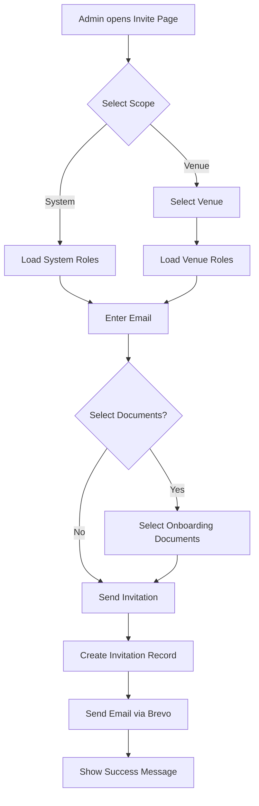
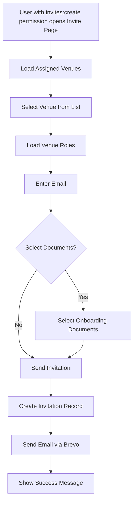
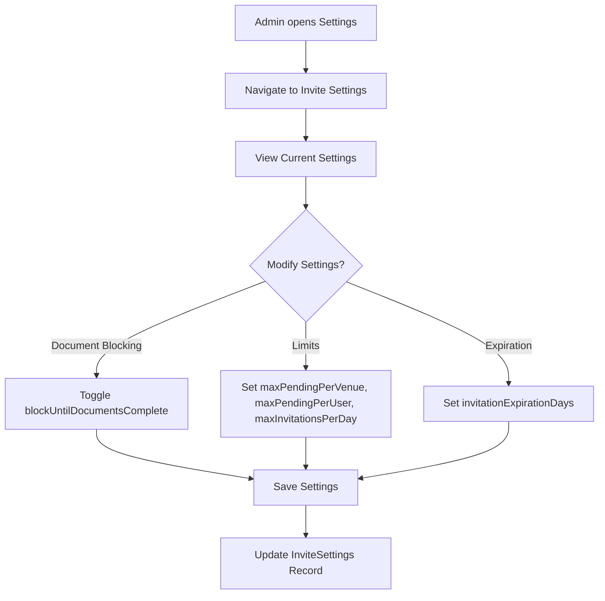
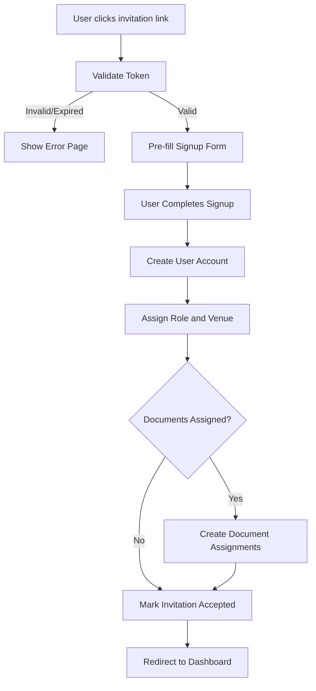

# User Invite System - Implementation Plan

## Overview

This document outlines the implementation plan for a comprehensive user invitation system that allows admins and authorized users to invite new users to the Staff Portal.

## Features

### Core Features
1. **Admin Invite Flow**: Admins can invite users at system level or for specific venues
2. **Permission-Based Invite Flow**: Any user with `invites:create` permission can invite users for their assigned venues only
3. **Role Selection**: Dynamic role selection based on venue or system context
4. **Document Assignment**: Placeholder for onboarding document assignment
5. **Email Invitations**: Send branded invitation emails with signup links via Brevo
6. **Auto Venue Assignment**: Users are automatically assigned to the venue they are invited to

### Configurable Settings (Admin UI)
- Document completion blocking (block access until documents completed)
- Invitation limits per venue/user
- Invitation expiration time

### Future Features (Placeholder)
- Onboarding documents system (forms, PDFs, fill-and-print)
- Document completion tracking
- Bulk invitations

---

## Database Schema

### New Models

#### 1. UserInvitation Model
Stores pending invitations with all necessary metadata.

```prisma
model UserInvitation {
  id              String          @id @default(cuid())
  email           String          // Recipient email
  token           String          @unique // Secure token for invitation link
  inviterId       String          // User who sent the invitation
  inviter         User            @relation("SentInvitations", fields: [inviterId], references: [id])
  
  // Invitation scope
  scope           String          // "SYSTEM" or "VENUE"
  venueId         String?         // Required if scope is VENUE
  venue           Venue?          @relation(fields: [venueId], references: [id])
  
  // Role assignment
  roleId          String          // Role to assign on signup
  role            Role            @relation(fields: [roleId], references: [id])
  
  // Document assignments (placeholder for future)
  documentIds     String[]        @default([]) // Array of OnboardingDocument IDs
  
  // Status tracking
  status          String          @default("PENDING") // PENDING, ACCEPTED, EXPIRED, CANCELLED
  acceptedAt      DateTime?
  acceptedBy      String?         // User ID of the user who accepted (if different from invited email)
  acceptedByUser  User?           @relation("AcceptedInvitations", fields: [acceptedBy], references: [id])
  
  // Expiration
  expiresAt       DateTime        // Default 7 days from creation
  
  // Timestamps
  createdAt       DateTime        @default(now())
  updatedAt       DateTime        @updatedAt
  
  @@index([email])
  @@index([token])
  @@index([inviterId])
  @@index([venueId])
  @@index([status])
  @@index([expiresAt])
  @@map("user_invitations")
}
```

#### 2. OnboardingDocument Model (Placeholder)
Venue-level documents for new hire onboarding.

```prisma
model OnboardingDocument {
  id              String          @id @default(cuid())
  venueId         String          // Venue that owns this document
  venue           Venue           @relation(fields: [venueId], references: [id])
  
  // Document details
  name            String          // Display name
  description     String?
  type            String          // "FORM", "PDF", "EXTERNAL_LINK"
  content         Json?           // Form fields, PDF URL, or external link
  isRequired      Boolean         @default(true)
  
  // Status
  active          Boolean         @default(true)
  
  // Timestamps
  createdAt       DateTime        @default(now())
  updatedAt       DateTime        @updatedAt
  
  @@index([venueId])
  @@index([active])
  @@map("onboarding_documents")
}
```

#### 3. UserDocumentAssignment Model (Placeholder)
Tracks which documents a user needs to complete.

```prisma
model UserDocumentAssignment {
  id              String          @id @default(cuid())
  userId          String
  user            User            @relation(fields: [userId], references: [id])
  documentId      String
  document        OnboardingDocument @relation(fields: [documentId], references: [id])
  invitationId    String?         // Link back to invitation if applicable
  invitation      UserInvitation? @relation(fields: [invitationId], references: [id])
  
  // Completion tracking
  status          String          @default("PENDING") // PENDING, IN_PROGRESS, COMPLETED, WAIVED
  completedAt     DateTime?
  waivedAt        DateTime?
  waivedBy        String?
  waivedByUser    User?           @relation("WaivedDocuments", fields: [waivedBy], references: [id])
  
  // Form data (if applicable)
  formData        Json?           // Store submitted form data
  
  createdAt       DateTime        @default(now())
  updatedAt       DateTime        @updatedAt
  
  @@unique([userId, documentId])
  @@index([userId])
  @@index([documentId])
  @@index([status])
  @@map("user_document_assignments")
}
```

### Schema Updates to Existing Models

```prisma
// Add to User model
model User {
  // ... existing fields ...
  
  // Invitation relations
  sentInvitations      UserInvitation[]      @relation("SentInvitations")
  acceptedInvitations  UserInvitation[]      @relation("AcceptedInvitations")
  waivedDocuments      UserDocumentAssignment[] @relation("WaivedDocuments")
  documentAssignments  UserDocumentAssignment[]
  
  // ... rest of model ...
}

// Add to Venue model
model Venue {
  // ... existing fields ...
  
  // Onboarding documents
  onboardingDocuments OnboardingDocument[]
  
  // ... rest of model ...
}

// Add to Role model
model Role {
  // ... existing fields ...
  
  // Invitations using this role
  invitations UserInvitation[]
  
  // ... rest of model ...
}
```

### New Model: InviteSettings
System-wide settings for invitation configuration (admin can modify).

```prisma
model InviteSettings {
  id                          String    @id @default(cuid())
  
  // Document blocking
  blockUntilDocumentsComplete Boolean   @default(false)
  
  // Invitation limits
  maxPendingPerVenue          Int       @default(50)
  maxPendingPerUser           Int       @default(20)
  maxInvitationsPerDay        Int       @default(100)
  
  // Expiration
  invitationExpirationDays    Int       @default(7)
  
  // Timestamps
  createdAt                   DateTime  @default(now())
  updatedAt                   DateTime  @updatedAt
  
  @@map("invite_settings")
}
```

---

## Permission System Updates

### New Permission Resource

Add `invites` to `PermissionResource` type in [`src/lib/rbac/permissions.ts`](src/lib/rbac/permissions.ts:49):

```typescript
export type PermissionResource =
  // ... existing resources ...
  | "invites"        // User invitation management
  | "onboarding"     // Onboarding documents management
```

### Permission Actions for Invites

| Action | Description |
|--------|-------------|
| `view` | View invitation list |
| `create` | Create new invitations |
| `cancel` | Cancel pending invitations |
| `resend` | Resend invitation emails |
| `view_all` | View all invitations (admin) |
| `manage` | Full invitation management |

### Permission Actions for Onboarding

| Action | Description |
|--------|-------------|
| `view` | View onboarding documents |
| `create` | Create onboarding documents |
| `edit` | Edit onboarding documents |
| `delete` | Delete onboarding documents |
| `assign` | Assign documents to users |
| `waive` | Waive document requirements |

### Default Role Permissions

**ADMIN:**
- `invites:*` - All invite permissions
- `onboarding:*` - All onboarding permissions
- Can invite at system level OR venue level

**MANAGER:**
- `invites:view` - View invitations for their venues
- `invites:create` - Create invitations for their venues
- `invites:cancel` - Cancel their own invitations
- `invites:resend` - Resend their own invitations
- `onboarding:view` - View documents for their venues
- `onboarding:assign` - Assign documents to new hires
- **Limited to their assigned venues only**

**STAFF:**
- No invite permissions by default
- Can be granted `invites:create` permission for specific venues

**Key Behavior:**
- Any user with `invites:create` permission can send invites
- Non-admin users are restricted to inviting users to their assigned venues only
- Invited users are automatically assigned to the venue specified in the invitation
- Admins can invite at system level (no venue) or for any venue

---

## API Design

### Server Actions

#### `src/lib/actions/invites.ts`

```typescript
// Create a new invitation
async function createInvitation(data: {
  email: string;
  scope: "SYSTEM" | "VENUE";
  venueId?: string;
  roleId: string;
  documentIds?: string[];
}): Promise<{ success: boolean; invitation?: UserInvitation; error?: string }>

// Get invitations list (filtered by user's permissions)
async function getInvitations(filters?: {
  status?: string;
  venueId?: string;
}): Promise<{ success: boolean; invitations?: UserInvitation[]; error?: string }>

// Cancel a pending invitation
async function cancelInvitation(invitationId: string): Promise<{ success: boolean; error?: string }>

// Resend invitation email
async function resendInvitation(invitationId: string): Promise<{ success: boolean; error?: string }>

// Validate invitation token (for signup page)
async function validateInvitationToken(token: string): Promise<{
  success: boolean;
  invitation?: UserInvitation;
  error?: string;
}>

// Accept invitation (called during signup)
async function acceptInvitation(token: string, userId: string): Promise<{
  success: boolean;
  error?: string;
}>
```

#### `src/lib/actions/onboarding.ts` (Placeholder)

```typescript
// Get onboarding documents for a venue
async function getOnboardingDocuments(venueId: string): Promise<{
  success: boolean;
  documents?: OnboardingDocument[];
  error?: string;
}>

// Create onboarding document
async function createOnboardingDocument(data: {
  venueId: string;
  name: string;
  description?: string;
  type: "FORM" | "PDF" | "EXTERNAL_LINK";
  content?: any;
  isRequired?: boolean;
}): Promise<{ success: boolean; document?: OnboardingDocument; error?: string }>

// Assign documents to user
async function assignDocumentsToUser(userId: string, documentIds: string[]): Promise<{
  success: boolean;
  error?: string;
}>
```

---

## UI Components

### Pages

#### 1. Admin Invite Page: `/system/invites`
- Full invitation management
- System-wide or venue-specific invitations
- All venues visible in dropdown
- All roles visible based on selection

#### 2. Manager Invite Page: `/manage/invites`
- Venue-restricted invitations
- Only assigned venues visible
- Only roles applicable to selected venue

#### 3. Invitation Acceptance: `/signup?invite={token}`
- Pre-filled email from invitation
- Role and venue pre-assigned
- Document requirements displayed (if any)

### Components

#### `InviteForm.tsx`
```typescript
interface InviteFormProps {
  scope: "SYSTEM" | "VENUE" | "VENUE_RESTRICTED";
  venues?: Venue[];           // Available venues (filtered for managers)
  roles: Role[];              // Available roles
  documents?: OnboardingDocument[];  // Available documents for venue
  onSubmit: (data: InviteFormData) => void;
}
```

#### `InvitationList.tsx`
```typescript
interface InvitationListProps {
  invitations: UserInvitation[];
  canCancel: boolean;
  canResend: boolean;
  onCancel: (id: string) => void;
  onResend: (id: string) => void;
}
```

#### `DocumentSelector.tsx` (Placeholder)
```typescript
interface DocumentSelectorProps {
  documents: OnboardingDocument[];
  selectedIds: string[];
  onSelectionChange: (ids: string[]) => void;
}
```

---

## Email Template

### New Template: `USER_INVITATION`

Add to [`src/lib/services/email/templates.ts`](src/lib/services/email/templates.ts):

```typescript
case "USER_INVITATION":
  return {
    subject: `🎉 You're invited to join ${venueName || "Staff Portal"}!`,
    htmlContent: createTemplate(
      `
        <h2>You've Been Invited!</h2>
        <p>${inviterName} has invited you to join ${venueName || "Staff Portal"} as a ${roleName}.</p>
        ${documentCount > 0 ? `
          <div class="highlight">
            <p style="margin: 0;"><strong>📋 Onboarding Required:</strong> You'll need to complete ${documentCount} document(s) after signing up.</p>
          </div>
        ` : ''}
        <p style="color: #6b7280; font-size: 14px;">This invitation will expire in 7 days.</p>
      `,
      "Accept Invitation",
      "#10b981"
    ),
  };
```

---

## User Flow Diagrams

### Admin Invite Flow



### Manager Invite Flow



### Admin Settings Flow



### Invitation Acceptance Flow



---

## Implementation Phases

### Phase 1: Core Invitation System (Priority)
1. Add database schema for `UserInvitation`
2. Add `invites` permission resource
3. Create invite server actions
4. Create email template
5. Build admin invite page
6. Build manager invite page
7. Create invitation acceptance flow

### Phase 2: Onboarding Documents (Future)
1. Add database schema for `OnboardingDocument` and `UserDocumentAssignment`
2. Add `onboarding` permission resource
3. Create document management UI
4. Create document assignment flow
5. Build document completion tracking
6. Create document templates (forms, PDFs)

### Phase 3: Enhanced Features (Future)
1. Bulk invitations
2. Invitation reminders
3. Custom invitation expiration
4. Invitation analytics
5. Document templates library

---

## Security Considerations

1. **Token Security**: Use cryptographically secure random tokens (32+ characters)
2. **Expiration**: Default 7-day expiration, configurable
3. **Rate Limiting**: Limit invitations per user per day
4. **Email Validation**: Verify email format and check for existing users
5. **Permission Checks**: Verify user can invite to selected venue/role
6. **Audit Logging**: Log all invitation actions

---

## Environment Variables

No new environment variables required. Uses existing:
- `BREVO_API_KEY` - For sending emails
- `BREVO_SENDER_EMAIL` - Sender email address
- `BREVO_SENDER_NAME` - Sender name
- `NEXT_PUBLIC_APP_URL` - For generating invitation links

---

## Files to Create/Modify

### New Files
- `src/lib/actions/invites.ts` - Invitation server actions
- `src/lib/actions/onboarding.ts` - Onboarding document actions (placeholder)
- `src/lib/actions/invite-settings.ts` - Admin settings for invite configuration
- `src/app/system/invites/page.tsx` - Admin invite page
- `src/app/manage/invites/page.tsx` - Permission-based invite page (for non-admins)
- `src/app/system/settings/invites/page.tsx` - Admin invite settings page
- `src/components/invites/InviteForm.tsx` - Invite form component
- `src/components/invites/InvitationList.tsx` - Invitation list component
- `src/components/invites/DocumentSelector.tsx` - Document selector (placeholder)
- `src/components/invites/InviteSettingsForm.tsx` - Admin settings form
- `src/lib/schemas/invites.ts` - Zod schemas for invitation validation

### Modified Files
- `prisma/schema.prisma` - Add new models
- `src/lib/rbac/permissions.ts` - Add `invites` and `onboarding` resources
- `src/lib/services/email/templates.ts` - Add `USER_INVITATION` template
- `src/lib/services/email/brevo.ts` - Add invitation email function
- `src/lib/types/notification.ts` - Add `USER_INVITATION` type

---

## Questions for Clarification

All questions have been answered:
- **ADMIN Role**: Can be invited at venue level too (no restrictions)
- **Document Blocking**: Configurable via Admin UI (default: off)
- **Invitation Limits**: Configurable via Admin UI (default: 50 per venue, 20 per user, 100 per day)
- **Self-Registration**: Remains enabled alongside invitations
