# Posts and Channels Module - Comprehensive Fix Plan

## Executive Summary

Investigation into why posts in the "Help" channel are not appearing revealed **multiple critical bugs** in the venue-based filtering logic. This document outlines the issues found and provides a comprehensive fix plan.

---

## Issues Identified

### Issue 1: CRITICAL - Users Cannot See Their Own Posts

**Location**: [`src/lib/utils/venue.ts:184`](src/lib/utils/venue.ts:184)

**Problem**: The `getSharedVenueUsers()` function excludes the current user from the returned list:
```typescript
id: { not: userId }, // Exclude the user themselves
```

When `getPosts()` uses this list to filter posts:
```typescript
authorId: { in: sharedVenueUserIds }, // User's own ID is NOT in this list!
```

**Impact**: 
- Users (including Admins) cannot see their own posts
- This affects ALL users, not just specific roles
- Posts appear to "disappear" after creation

**Fix**: Modify `getPosts()` to explicitly include the current user's ID in the author filter.

---

### Issue 2: Channels Without Venue Assignments Are Invisible

**Location**: [`src/lib/utils/venue.ts:476-498`](src/lib/utils/venue.ts:476)

**Problem**: Non-admin users can only see channels that are assigned to their venues via the `ChannelVenue` junction table. If a channel has no venue assignments, it's invisible to all non-admin users.

**Impact**:
- New channels created without venue assignments are invisible
- "Help" channel likely has no `ChannelVenue` records
- Users see empty channel list even though channels exist

**Fix**: Add `isPublic` flag to `Channel` model for global channels visible to all users.

---

### Issue 3: No User Feedback for Empty States

**Location**: [`src/components/posts/PostFeed.tsx:111-122`](src/components/posts/PostFeed.tsx:111)

**Problem**: When no posts are found, users see a generic "No posts yet" message without explanation of why.

**Impact**:
- Users don't understand why they can't see posts
- No guidance on how to resolve the issue
- Creates confusion and support requests

**Fix**: Add contextual messages explaining venue-based access and channel visibility.

---

### Issue 4: Admin Bypass Not Working for Posts

**Location**: [`src/lib/actions/posts.ts:90-176`](src/lib/actions/posts.ts:90)

**Problem**: While `getSharedVenueUsers()` and `getAccessibleChannelIds()` have admin bypass logic, the post author filter still excludes the admin's own posts due to Issue 1.

**Impact**:
- Admins cannot see their own posts
- Admins cannot effectively test the posts feature
- Breaks the expected "superuser" behavior

---

## Architecture Diagram

```mermaid
flowchart TD
    subgraph Current Flow - BROKEN
        A1[User creates post] --> B1[Post saved to DB]
        B1 --> C1[User views posts]
        C1 --> D1[getPosts called]
        D1 --> E1[getSharedVenueUsers excludes current user]
        E1 --> F1[Filter: authorId IN sharedVenueUserIds]
        F1 --> G1[User's own posts EXCLUDED]
        G1 --> H1[No posts displayed]
    end
    
    subgraph Fixed Flow
        A2[User creates post] --> B2[Post saved to DB]
        B2 --> C2[User views posts]
        C2 --> D2[getPosts called]
        D2 --> E2[Include current user ID in author filter]
        E2 --> F2[Filter: authorId IN sharedVenueUserIds OR authorId = currentUser]
        F2 --> G2[User's own posts INCLUDED]
        G2 --> H2[Posts displayed correctly]
    end
```



---

## Database Schema Changes

### Add `isPublic` to Channel Model

```prisma
model Channel {
  id          String   @id @default(cuid())
  name        String   @unique
  description String?
  type        String
  icon        String?
  color       String?
  permissions Json?
  archived    Boolean  @default(false)
  archivedAt  DateTime?
  memberCount Int      @default(0)
  createdBy   String?
  
  // NEW FIELD: Public channels visible to all users
  isPublic    Boolean  @default(false)
  
  createdAt   DateTime @default(now())
  updatedAt   DateTime @updatedAt
  
  members ChannelMember[]
  venues  ChannelVenue[]
  posts   Post[]
  
  @@map("channels")
}
```

**Migration**:
```sql
ALTER TABLE channels ADD COLUMN "isPublic" BOOLEAN NOT NULL DEFAULT false;
```

---

## Implementation Plan

### Phase 1: Fix Critical Bug - Users Should See Their Own Posts

**Files to modify**:
- `src/lib/actions/posts.ts`

**Changes**:
```typescript
// In getPosts function, modify the where clause:
const posts = await prisma.post.findMany({
  where: {
    // FIX: Include current user's own posts
    OR: [
      { authorId: user.id }, // User's own posts
      {
        AND: [
          { authorId: { in: sharedVenueUserIds } },
          { channelId: { in: accessibleChannelIds } },
        ],
      },
    ],
    // ... rest of filters
  },
});
```

---

### Phase 2: Add isPublic Flag to Channel Model

**Files to modify**:
- `prisma/schema.prisma`
- Create new migration

**Changes**:
1. Add `isPublic Boolean @default(false)` to Channel model
2. Run `npx prisma migrate dev --name add_channel_is_public`

---

### Phase 3: Update getAccessibleChannelIds to Include Public Channels

**Files to modify**:
- `src/lib/utils/venue.ts`

**Changes**:
```typescript
export async function getAccessibleChannelIds(userId: string): Promise<string[]> {
  const currentUser = await prisma.user.findUnique({
    where: { id: userId },
    select: {
      id: true,
      active: true,
      role: { select: { name: true } },
      venues: {
        where: { venue: { active: true } },
        select: { venueId: true },
      },
    },
  });

  if (!currentUser || !currentUser.active) {
    return [];
  }

  const userIsAdmin = currentUser.role.name === "ADMIN";

  if (userIsAdmin) {
    // Admin: ALL non-archived channels
    const allChannels = await prisma.channel.findMany({
      where: { archived: false },
      select: { id: true },
    });
    return allChannels.map((c) => c.id);
  }

  // Non-admin: venue-assigned channels OR public channels
  const venueIds = currentUser.venues.map((v) => v.venueId);

  // Get channels from venue assignments
  const channelVenues = venueIds.length > 0 
    ? await prisma.channelVenue.findMany({
        where: { venueId: { in: venueIds } },
        include: { channel: { select: { id: true, archived: true } } },
      })
    : [];

  const venueChannelIds = channelVenues
    .filter((cv) => !cv.channel.archived)
    .map((cv) => cv.channelId);

  // Get public channels
  const publicChannels = await prisma.channel.findMany({
    where: { isPublic: true, archived: false },
    select: { id: true },
  });
  const publicChannelIds = publicChannels.map((c) => c.id);

  // Combine and deduplicate
  return [...new Set([...venueChannelIds, ...publicChannelIds])];
}
```

---

### Phase 4: Update getPosts to Include Public Channel Posts

**Files to modify**:
- `src/lib/actions/posts.ts`

**Changes**:
```typescript
export async function getPosts(filters?: FilterPostsInput) {
  const user = await requireAuth();

  try {
    const validatedFilters = filters
      ? filterPostsSchema.parse(filters)
      : { limit: 20 };

    const sharedVenueUserIds = await getSharedVenueUsers(user.id);
    const accessibleChannelIds = await getAccessibleChannelIds(user.id);

    // Get public channel IDs for additional filtering
    const publicChannels = await prisma.channel.findMany({
      where: { isPublic: true, archived: false },
      select: { id: true },
    });
    const publicChannelIds = publicChannels.map((c) => c.id);

    const posts = await prisma.post.findMany({
      where: {
        OR: [
          // User's own posts in any accessible channel
          {
            authorId: user.id,
            channelId: { in: accessibleChannelIds },
          },
          // Posts from shared venue users in accessible channels
          {
            authorId: { in: sharedVenueUserIds },
            channelId: { in: accessibleChannelIds },
          },
          // Posts from anyone in public channels
          {
            channelId: { in: publicChannelIds },
          },
        ],
        // Apply additional filters
        ...(validatedFilters.channelId && {
          channelId: validatedFilters.channelId,
        }),
        ...(validatedFilters.authorId && {
          authorId: validatedFilters.authorId,
        }),
        ...(validatedFilters.pinned !== undefined && {
          pinned: validatedFilters.pinned,
        }),
      },
      // ... rest of query
    });

    return { success: true, posts };
  } catch (error) {
    console.error("Error fetching posts:", error);
    return { error: "Failed to fetch posts" };
  }
}
```

---

### Phase 5: Add Channel Visibility UI Indicators

**Files to modify**:
- `src/components/posts/ChannelList.tsx`
- `src/app/manage/channels/channels-page-client.tsx`

**Changes**:
1. Add "Public" badge to public channels in channel list
2. Add visibility indicator in channel settings
3. Add toggle for `isPublic` in channel creation/edit forms

---

### Phase 6: Add User Feedback for Empty States

**Files to modify**:
- `src/components/posts/PostFeed.tsx`
- `src/components/posts/ChannelList.tsx`

**Changes**:
```typescript
// In PostFeed.tsx
if (posts.length === 0) {
  return (
    <div className="flex h-[400px] flex-col items-center justify-center gap-2 text-center">
      <p className="text-sm font-medium">No posts visible</p>
      <p className="text-sm text-muted-foreground max-w-md">
        {channelId
          ? "This channel has no posts yet, or posts are from users outside your venue."
          : "You may not have access to posts in any channels. Contact your administrator."}
      </p>
      {!channelId && (
        <Button variant="outline" size="sm" className="mt-2">
          Learn about venue access
        </Button>
      )}
    </div>
  );
}
```

---

### Phase 7: Test All Scenarios

**Test Matrix**:

| Scenario | User Role | Channel Type | Expected Result |
|----------|-----------|--------------|-----------------|
| View own post | Admin | Any | Visible |
| View own post | Manager | Any | Visible |
| View own post | Staff | Any | Visible |
| View others post | Admin | Any | Visible |
| View others post | Manager | Venue-assigned | Visible |
| View others post | Manager | Public | Visible |
| View others post | Manager | Unassigned | Not visible |
| View others post | Staff | Venue-assigned | Visible |
| View others post | Staff | Public | Visible |
| View others post | Staff | Unassigned | Not visible |
| Create post | Any | Public channel | Success |
| Create post | Any | Venue-assigned | Success |

---

## Rollback Plan

If issues arise after deployment:

1. **Revert Phase 1 changes**: Remove the OR clause in getPosts, restore original filter
2. **Revert Phase 2 changes**: Set `isPublic = false` for all channels via migration
3. **Revert Phase 3 changes**: Restore original getAccessibleChannelIds function

---

## Estimated Effort

| Phase | Complexity | Risk |
|-------|------------|------|
| Phase 1 | Low | Low |
| Phase 2 | Low | Low |
| Phase 3 | Medium | Medium |
| Phase 4 | Medium | Medium |
| Phase 5 | Low | Low |
| Phase 6 | Low | Low |
| Phase 7 | Medium | Low |

---

## Dependencies

- Phase 2 must complete before Phase 3
- Phase 3 must complete before Phase 4
- Phases 5 and 6 can run in parallel after Phase 4
- Phase 7 should run after all other phases

---

## Questions for Clarification

1. Should existing channels be marked as public by default during migration?
2. Should there be a permission for who can mark channels as public?
3. Should public channels still respect channel-level permissions (canCreatePosts, etc.)?
