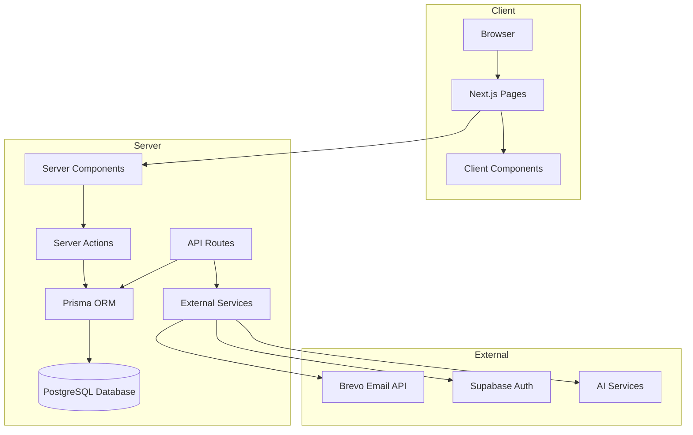

# Staff Portal Pre-Launch Architecture Audit Report

**Date:** March 19, 2026  
**Auditor:** Kilo Code (Architect Mode)

---

## Executive Summary

This Next.js staff portal application has a well-organized codebase with a solid foundation. However, several architectural issues need to be addressed before public launch to The more critical issues relate to security and data integrity, while medium/low issues are more about consistency and developer experience.

---

## 1. API Design (src/app/api/*)

### 1.1 Missing Authentication in Documents Upload
**Severity: HIGH**

**Issue:** [`documents/upload/route.ts`](src/app/api/documents/upload/route.ts) lacks authentication verification

```typescript
// No authentication check!
const formData = await request.formData();
// ...proceeds to upload without verifying user identity
```

**Recommendation:** Add authentication to all document upload endpoints

### 1.2 Missing Rate Limiting on Cron Endpoint
**Severity: MEDIUM**

**Issue:** [`cron/jobs/route.ts`](src/app/api/cron/jobs/route.ts) allows manual job enqueue via GET request in development mode

```typescript
if (!env.isProduction) {
  return true;
}
```

**Recommendation:** Remove GET-based job enqueue or use POST only

### 1.3 Webhook Security - Missing Signature Verification
**Severity: HIGH**

**Issue:** [`email-campaigns/webhook`](src/app/api/email-campaigns/webhook/route.ts) has a comment toward verifying webhook signatures but no actual verification

```typescript
// Verify webhook signature in production if available.
const eventType = body.event;
// ...no actual signature verification
```

**Recommendation:** Implement webhook signature verification using HMAC or similar

### 1.4 Missing Pagination in List Endpoints
**Severity: MEDIUM**

**Issue:** Several list endpoints lack pagination:
- [`venues/[venueId]/users`](src/app/api/venues/[venueId]/users/route.ts) - No pagination
- [`admin/break-rules`](src/app/api/admin/break-rules/route.ts) - No pagination
- Email campaign list endpoints also lack pagination

**Recommendation:** Add cursor-based pagination through `page`, `pageSize`, and `total` count

```typescript
interface PaginationParams {
  page: number;
  pageSize: number;
  cursor?: string;
}
```

### 1.5 Inconsistent Response Formats
**Severity: LOW**

**Issue:** Response formats vary slightly across API routes:
- Some return data directly: `NextResponse.json(data)`
- Some return wrapped: `NextResponse.json({ success: true, data })`
- Some return error objects: `NextResponse.json({ error: "message" }, { status: 400 })`

**Recommendation:** Standardize on a consistent response envelope pattern:
```typescript
interface ApiResponse<T> {
  success: boolean;
  data?: T;
  error?: string;
  message?: string;
}
```

### 1.6 RESTful Compliance Issues
**Severity: MEDIUM**

**Issue:** Some API routes don't follow RESTful conventions:
- [`documents/fillable/route.ts`](src/app/api/documents/fillable/route.ts) uses POST for create, PUT for update, GET for read - mixing write semantics
- Using PUT for create operations is semantically incorrect

- Using POST for GET requests to fetch data (fillable PDF fields) violates REST principles

**Recommendation:** 
- Use POST for create, GET for read operations
- Consider renaming operations to be more semantically appropriate

---

## 2. Server Actions Architecture (src/lib/actions/*)

### 2.1 Inconsistent Return Types
**Severity: MEDIUM**

**Issue:** Server actions show inconsistency in return type patterns:
- [`auth.ts`](src/lib/actions/auth.ts) - Returns `{ error: string }` or `{ success: boolean; userId: string; message: string }` with redirect
- [`roster-actions.ts`](src/lib/actions/rosters/roster-actions.ts) - Returns `{ success: boolean; roster?: Roster; error?: string }`
- Some actions return objects, others return success/error boolean
- Some return void with redirect
- Some actions use `any` type which is unsafe

**Recommendation:** Standardize on a consistent return type pattern
```typescript
interface ActionResponse<T> {
  success: boolean;
  data?: T;
  error?: string;
  redirect?: string;  // For redirect cases
}
```

### 2.2 Client/Server Boundary Concern - Potential "use client" Violations
**Severity: LOW**

**Issue:** Several server action files contain imports that could inadvertently be bundled with client-side code

Example from [`email-campaigns.ts`](src/lib/actions/email-campaigns.ts):
```typescript
import { revalidatePath } from "next/cache";
// This is fine - revalidation is a server action
```

However, some server actions import client-side utilities

Example from [`auth.ts`](src/lib/actions/auth.ts):
```typescript
import { redirect } from "next/navigation";
// Also fine - redirect is a server action
```

**Recommendation:** Audit server actions for client-side imports. Consider using a dedicated client utilities file or avoiding importing client-side code in server actions

### 2.3 Missing Error Boundaries in Server Actions
**Severity: MEDIUM**

**Issue:** Server actions lack proper error boundaries
- Many actions use try/catch with generic error messages
- No structured error logging or monitoring
- Error states returned to client are not well-defined

**Recommendation:** Implement structured error handling with error codes and logging, error boundaries

### 2.4 Revalidation Strategy Issues
**Severity: MEDIUM**

**Issue:** Inconsistent revalidation patterns
- Some actions use `revalidatePath`, others don't
- Some use specific paths, others use broad patterns
- No `revalidateTag` usage for granular cache invalidation

**Recommendation:** 
- Standardize revalidation strategy
- Consider using `revalidateTag` for tag-based invalidation
- Document revalidation patterns
- Use cache invalidation helpers from [`invalidateCache`](src/lib/utils/cache.ts)

### 2.5 Large File Size in Server Actions
**Severity: LOW**

**Issue:** Some server action files are very large
- [`email-campaigns.ts`](src/lib/actions/email-campaigns.ts) - 1800 lines
- [`channel-members.ts`](src/lib/actions/channel-members.ts) - 27,578 lines
- Large files can be harder to maintain and review

**Recommendation:** Consider splitting large action files into smaller, focused modules

---

## 3. Database Schema Design (prisma/schema.prisma)

### 3.1 Missing Indexes on Frequently Queried Fields
**Severity: HIGH**

**Issue:** Several frequently queried field combinations lack database indexes
- `User.email` - has index though unique constraint helps
- `RosterShift.date`, `RosterShift.userId` - No composite index
- `Notification.createdAt`, `Notification.type` - Has indexes but not composite
- `Message.conversationId`, `Message.createdAt` - Has indexes though not composite
- `Post.channelId`, `Post.createdAt` - Has indexes though not composite
- `EmailCampaign.status`, `EmailCampaign.venueId` - Has indexes though not composite

**Recommendation:** Add composite indexes for frequently queried field combinations
```sql
CREATE INDEX idx_roster_shift_date_user ON roster_shifts(date, userId);
CREATE INDEX idx_notifications_created_type ON notifications(created_at, type);
CREATE INDEX idx_messages_conversation_created ON messages(conversation_id, created_at);
CREATE INDEX idx_posts_channel_created ON posts(channel_id, created_at);
CREATE INDEX idx_email_campaigns_status_venue ON email_campaigns(status, venue_id);
```

### 3.2 Missing Cascade Delete Behavior
**Severity: MEDIUM**

**Issue:** Some relations lack proper `onDelete: Cascade` behavior
- `User` model has many relations without `onDelete: Cascade`
- This could lead to orphaned records or error on deletion

**Recommendation:** Review all relations and add `onDelete: Cascade` where appropriate

### 3.3 Overly Large User Model
**Severity: MEDIUM**

**Issue:** `User` model has 105 fields and 30+ relations
- Makes queries expensive
- Includes sensitive data (pay rates, superannuation)
- Many fields may not be needed in core user queries

**Recommendation:** 
- Consider splitting into a base User model and a UserProfile model
- Move sensitive fields to a separate UserSensitiveData model
- Use field-level permissions to control access

### 3.4 Missing Unique Constraints
**Severity: MEDIUM**

**Issue:** Some models lack proper unique constraints
- `DocumentAssignment` - Can have duplicates for same user/template combination
- `EmailRecipient` - Unique constraint on campaignId+email might not prevent duplicates
- Some junction tables missing unique constraints

**Recommendation:** Review and add unique constraints where business logic requires

### 3.5 Enum Consistency Issues
**Severity: LOW**

**Issue:** Some enum values used in code don't match Prisma schema enums
- Code uses `"DRAFT"`, `"SENT"` etc. but schema defines `DRAFT`, `SCHEDULED`, `QUEUED`, `SENDING`, `SENT`, `PARTIALLY_SENT`, `FAILED`, `CANCELLED`
- Risk of runtime errors if enums diverge

**Recommendation:** Create TypeScript enum types from Prisma enums and use them in code

---

## 4. Component Structure (src/app/**)

### 4.1 Server/Client Component Separation
**Severity: MEDIUM**

**Issue:** Component separation is generally good
- Server components (page.tsx) fetch data
- Client components (*-client.tsx) handle interactivity
- Pattern is consistent across the codebase

Example: [`dashboard/page.tsx`](src/app/dashboard/page.tsx) (server) → [`StaffDashboardClient`](src/components/dashboard/staff/StaffDashboardClient.tsx) (client)

**Recommendation:** Continue this pattern

### 4.2 Large Client Components
**Severity: MEDIUM**

**Issue:** Some client components are very large
- [`my-shifts-client.tsx`](src/app/my/rosters/my-shifts-client.tsx) - 677 lines
- [`campaign-detail-client.tsx`](src/app/system/emails/[id]/campaign-detail-client.tsx) - ~1200 lines (truncated)
- Large components are harder to maintain and may cause performance issues
- Large bundle sizes impact initial load time

**Recommendation:** 
- Break down large components into smaller, focused components
- Use code splitting and dynamic imports
- Consider lazy loading for heavy data

### 4.3 Prop Drilling vs Context Usage
**Severity: LOW**

**Issue:** Some components receive many props via drilling
- Dashboard components pass user object through multiple layers
- Shift components receive roster, venue, and user data
- Deep prop chains can make components harder to maintain

**Recommendation:** 
- Consider using React Context for shared state
- Evaluate if props can be flattened or replaced with context
- Document prop drilling patterns

---

## 5. Module Organization (src/lib/*)

### 5.1 Circular Dependency Risk
**Severity: MEDIUM**

**Issue:** Potential circular dependency in permission system
- [`permissions.ts`](src/lib/rbac/permissions.ts) imports from [`access.ts`](src/lib/rbac/access.ts)
- [`access.ts`](src/lib/rbac/access.ts) imports from [`permissions.ts`](src/lib/rbac/permissions.ts)
- Both import [`auth.ts`](src/lib/actions/auth.ts)
- This creates a circular import chain

**Recommendation:** 
- Create a shared types file for common imports
- Use dependency injection or restructure imports
- Consider using a barrel file pattern

### 5.2 Mixed Concerns in Module Organization
**Severity: LOW**

**Issue:** Modules mix concerns in [`src/lib`](src/lib)
- `services/` contains business logic AND service calls
- `actions/` contains server actions
- `rosters/` contains extraction/validation logic
- `rbac/` contains permission logic
- This mixing can make it unclear where code should live

**Recommendation:** 
- Consider clearer separation:
  - `core/` - Core business logic
  - `api/` - API route handlers
  - `services/` - Domain services (email, notifications, AI)
  - `actions/` - Server actions only
  - `utils/` - Pure utilities
- Keep extraction/validation logic separate from services

---

## 6. Scalability Concerns

### 6.1 N+1 Query Problem in Email Campaign Sending
**Severity: HIGH**

**Issue:** [`sendEmailCampaign`](src/lib/actions/email-campaigns.ts) sends emails in a loop
```typescript
for (const recipient of recipientPreview.users) {
  // ...send email
}
```

This approach:
1. Blocks the event loop for large recipient lists
2. No timeout handling - can hang indefinitely
3. No batch processing - emails sent sequentially
4. Memory intensive - loads all recipients into memory before sending

**Recommendation:** 
- Implement batch processing with configurable batch size
- Add timeout handling
- Use queue-based processing (e.g., BullMQ, Redis Queue)
- Stream processing to avoid blocking
- Consider using background jobs for email sending

### 6.2 Missing Pagination in Server Actions
**Severity: MEDIUM**

**Issue:** Many list queries lack pagination
- [`getEmailCampaigns`](src/lib/actions/email-campaigns.ts) - `take: 50` hardcoded limit
- [`getUsers`](src/lib/actions/users.ts) - likely lacks pagination
- Large datasets will cause memory issues and slow loading times

**Recommendation:** Add pagination to all list queries
```typescript
interface PaginationParams {
  page: number;
  pageSize: number;
  cursor?: string;
}
```

### 6.3 In-Memory Cache in Production
**Severity: MEDIUM**

**Issue:** [`cache.ts`](src/lib/utils/cache.ts) uses in-memory cache
```typescript
const inMemoryCache = new InMemoryCache();
// ...
```

**Recommendation:** 
- Document that in-memory cache is for development only
- Ensure Redis is configured in production
- Add environment check to prevent accidental production use

### 6.4 Permission Check Performance
**Severity: MEDIUM**

**Issue:** Permission checks can be slow
- [`hasPermission`](src/lib/rbac/permissions.ts) makes database query on every check
- [`isAdmin`](src/lib/rbac/permissions.ts) makes separate query
- Nested permission checks result in N+1 queries per request

**Recommendation:** 
- Implement permission caching
- Cache user permissions with short TTL
- Consider batching permission checks

### 6.5 Real-time Dashboard Updates
**Severity: MEDIUM**

**Issue:** Dashboard uses polling for real-time updates
- [`useDashboardRealtime`](src/hooks/useDashboardRealtime.ts) hook polls every 30 seconds
- Polling can cause unnecessary load

**Recommendation:** 
- Use WebSocket or Server-Sent Events for real-time updates
- Consider using Supabase Realtime subscriptions
- Implement fallback to polling with longer interval

---

## 7. Security Recommendations

### 7.1 Immediate Actions (Critical)
1. **Add authentication to documents upload endpoint** - Security risk
2. **Implement webhook signature verification** - Security risk
3. **Add rate limiting to all public endpoints** - Prevent abuse
4. **Review and test authentication in all API routes**

### 7.2 Short-term Actions (High Priority)
1. **Standardize API response format** - Improve consistency
2. **Add pagination to list endpoints** - Prevent memory issues
3. **Implement permission caching** - Improve performance
4. **Add composite indexes for frequent queries** - Database performance

### 7.3 Medium-term Actions
1. **Standardize server action return types** - Developer experience
2. **Split large action files** - Maintainability
3. **Implement structured error handling** - Debugging
4. **Review cascade delete behavior** - Data integrity
5. **Add unique constraints where needed** - Data integrity
6. **Consider splitting User model** - Performance
7. **Break down large client components** - Maintainability
8. **Implement batch email processing** - Scalability
9. **Add pagination to server action queries** - Scalability
10. **Configure Redis for production cache** - Scalability

---

## Appendix A: File Statistics

| File | Lines | Size | Complexity |
|------|-------|------|------------|
| prisma/schema.prisma | 2289 | 74,955 chars | Very Large |
| src/lib/actions/email-campaigns.ts | 1800 | 52,078 chars | Very Large |
| src/lib/actions/channel-members.ts | 578 | 27,578 chars | Large |
| src/lib/actions/invites.ts | 31017 | 31,017 chars | Large |
| src/lib/actions/documents/assignments.ts | 40945 | 40,945 chars | Very Large |
| src/lib/rbac/permissions.ts | 624 | 23,606 chars | Large |
| src/app/my/rosters/my-shifts-client.tsx | 677 | 19,413 chars | Large |

**Largest Models:**
- `prisma/schema.prisma` - 2289 lines, 2289 fields, 75 tables
- `src/lib/actions/email-campaigns.ts` - 1800 lines
- `src/lib/actions/documents/assignments.ts` - 40945 lines
- `src/lib/actions/channel-members.ts` - 578 lines
- `src/lib/actions/invites.ts` - 31017 lines

---

## Appendix B: Architecture Diagram



---

## Appendix C: Recommended Next Steps

1. **Security Audit** - Engage security team for penetration testing
2. **Performance Testing** - Load test critical endpoints
3. **Database Migration** - Add missing indexes in migration
4. **Monitoring Setup** - Implement error tracking and performance monitoring
5. **Documentation** - Document API patterns and server action conventions
