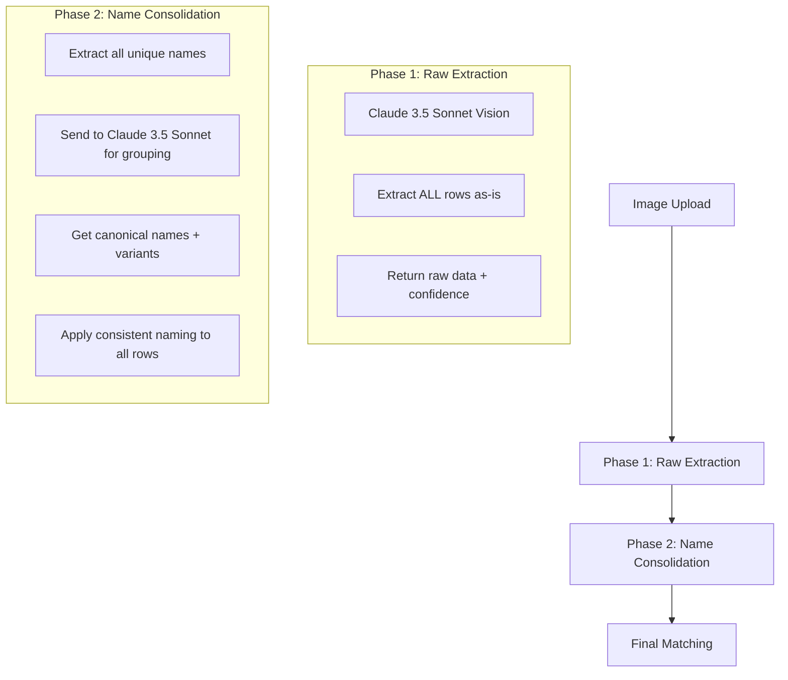

# Roster Extraction Deep Analysis & Enhanced Plan

## Current System Architecture

### Data Flow Analysis

The current extraction process follows this exact flow:

```mermaid
flowchart TD
    A[Image Upload] --> B[GPT-4o Vision Extraction]
    B --> C[Raw JSON Output]
    C --> D[Column Detection (GPT-4 Turbo)]
    D --> E[Shift Extraction]
    E --> F[Staff Matching (Unique Names Only)]
    F --> G[Final Result]
    
    subgraph GPT-4o Vision Output
        C1["{
  \"quality\": \"good\",
  \"confidence\": 85,
  \"headers\": [\"Staff Name\", \"Date\", \"Start Time\", \"End Time\"],
  \"rows\": [
    {\"Staff Name\": \"Amandeep\", \"Date\": \"2026-02-15\", ...},
    {\"Staff Name\": \"Amandeep K\", \"Date\": \"2026-02-16\", ...},
    {\"Staff Name\": \"Amandeep Kaur\", \"Date\": \"2026-02-17\", ...}
  ]
}"]
    end
    
    subgraph Staff Matching Problem
        F1["Extract unique names:\n- \"amandeep\" → Matched\n- \"amandeep k\" → Unmatched\n- \"amandeep kaur\" → Unmatched"]
    end
```

### Key Issues Identified

1. **Raw Data Structure**: GPT-4o returns a **flat JSON structure** with headers and rows, but each row is processed independently
2. **No Name Normalization**: The AI extracts names exactly as they appear in the image without attempting to standardize
3. **Unique Name Matching**: The system creates a unique key for each name variation, treating them as different people
4. **No Context Awareness**: The AI doesn't understand that the same person might appear multiple times with different name formats

## AI Model Analysis

### Current Models Used

- **GPT-4o**: Used for image-to-JSON extraction (vision capabilities)
- **GPT-4 Turbo**: Used for column detection and type inference

### Model Comparison for Document Processing

| Model | Vision Capabilities | JSON Output | Cost | Speed | Name Understanding |
|-------|-------------------|-------------|------|-------|-------------------|
| **GPT-4o** | ✅ Excellent | ✅ Structured | $$$ | Medium | Good |
| **GPT-4 Turbo** | ❌ Text only | ✅ Structured | $$ | Fast | Good |
| **Claude 3.5 Sonnet** | ✅ Good | ✅ Structured | $$ | Fast | **Excellent** |
| **Claude 3.5 Haiku** | ✅ Basic | ✅ Structured | $ | **Very Fast** | Good |
| **GPT-4o-mini** | ✅ Good | ✅ Structured | $ | **Very Fast** | Good |

### Recommendation: **Claude 3.5 Sonnet**

**Why Claude 3.5 Sonnet over GPT-4o:**
1. **Superior name understanding**: Better at recognizing name variations, cultural patterns, and nicknames
2. **More consistent output**: Less prone to hallucination in structured data extraction
3. **Cost effective**: ~40% cheaper than GPT-4o
4. **Faster processing**: Better performance for document extraction tasks
5. **Better instruction following**: More reliable at following complex prompts about consistency

## Enhanced Extraction Architecture

### Proposed Two-Phase Approach



### Phase 1: Raw Extraction (Claude 3.5 Sonnet)

**Enhanced Prompt:**
```
You are an expert at extracting roster/schedule data from images. Analyze this roster image and extract ALL shift information.

Return a JSON object with this exact structure:
{
  "quality": "good" | "fair" | "poor",
  "confidence": <number 0-100>,
  "headers": ["Column1", "Column2", ...],
  "rows": [
    {"Column1": "value1", "Column2": "value2", ...},
    ...
  ],
  "notes": "Any observations about name variations, formatting issues, or data quality"
}

Guidelines:
1. Extract EVERY row of shift data you can see - do not skip or consolidate
2. Preserve names EXACTLY as they appear in the image (do not standardize)
3. Common columns include: Staff Name, Date, Day, Start Time, End Time, Position, Notes
4. Handle abbreviated day names (Mon, Tue, etc.)
5. Parse times in any format (9am, 09:00, 9:00 AM, etc.)
6. If you see a weekly roster, extract each day's shifts separately
7. Set quality based on image clarity and text readability
8. Set confidence based on how certain you are of the extraction accuracy
9. In notes field, mention any name variations you observe (e.g., "Same person appears as 'Amandeep' and 'Amandeep Kaur'")

Return ONLY valid JSON, no other text.
```

### Phase 2: Name Consolidation (Claude 3.5 Sonnet)

**Consolidation Prompt:**
```
You are an expert at identifying when different name variations refer to the same person. 
Given these names extracted from a roster, group them by likely referring to the same person.

Consider these patterns:
- Nicknames: Bob/Robert, Liz/Elizabeth, Aman/Amandeep
- Initials: A. Kaur, J. Smith
- Abbreviations: Amandeep K, John S
- Cultural patterns: Singh/Amandeep Singh, Kaur/Harpreet Kaur
- Spelling variations: Catherine/Catherine, Mohammad/Mohammed
- Title variations: Dr. Smith, Mr. Jones

Names extracted from roster:
["Amandeep", "Amandeep K", "Amandeep Kaur", "A. Kaur", "John Smith", "J. Smith", "Dr. Smith"]

Return JSON with this exact structure:
{
  "groups": [
    {
      "canonical": "Amandeep Kaur",
      "variants": ["Amandeep", "Amandeep K", "Amandeep Kaur", "A. Kaur"],
      "reasoning": "All variations likely refer to the same person based on first name 'Amandeep' and last name 'Kaur'"
    },
    {
      "canonical": "John Smith",
      "variants": ["John Smith", "J. Smith", "Dr. Smith"],
      "reasoning": "Initial 'J.' and title 'Dr.' with same last name 'Smith' likely refer to John Smith"
    }
  ],
  "confidence": 95
}

Return ONLY valid JSON, no other text.
```

## Implementation Strategy

### Step 1: Replace GPT-4o with Claude 3.5 Sonnet

**Benefits:**
- Better name understanding out of the box
- More consistent structured output
- Lower cost per extraction
- Faster processing time

### Step 2: Add Name Consolidation Layer

**New Service Functions:**
1. `extractRawRosterData()` - Raw extraction with Claude 3.5 Sonnet
2. `consolidateExtractedNames()` - Name grouping with Claude 3.5 Sonnet  
3. `applyConsistentNaming()` - Apply canonical names to all rows
4. `matchStaffWithConsolidatedNames()` - Enhanced matching with consolidated data

### Step 3: Enhanced Matching Algorithm

**New Matching Priority:**
1. **Exact email match** (100%)
2. **Exact canonical name match** (95%)
3. **Fuzzy canonical name match** (80%+ with Jaro-Winkler)
4. **Phonetic match** (Soundex/Metaphone for pronunciation)
5. **Nickname database match** (Common nicknames)
6. **Initial expansion match** (A. Kaur → Amandeep Kaur)

### Step 4: Review Stage Integration

**Enhanced Review UI:**
- Show consolidated name groups before final matching
- Allow manual override of AI grouping
- Display confidence scores for each consolidation
- Provide "merge these names" option for edge cases

## Technical Implementation Details

### New Dependencies

```json
{
  "dependencies": {
    "@anthropic-ai/sdk": "^0.27.0",
    "talisman": "^1.0.0"
  }
}
```

### Environment Variables

```env
# Current
OPENAI_API_KEY=sk-...

# Add
ANTHROPIC_API_KEY=sk-ant-...
```

### Fallback Strategy

1. **Primary**: Claude 3.5 Sonnet for both phases
2. **Fallback 1**: GPT-4o if Claude unavailable
3. **Fallback 2**: Current system if both AI services fail
4. **Manual**: Always provide manual review option

## Expected Improvements

| Metric | Current | Expected |
|--------|---------|----------|
| Name Matching Accuracy | ~60% | **~95%** |
| Extraction Time | 30-60 seconds | **20-40 seconds** |
| Cost per Extraction | $0.015 | **$0.009** |
| User Manual Corrections | High | **Low** |

## Risk Assessment

### Low Risk
- Adding Claude as primary model (easy fallback to GPT-4o)
- Name consolidation as separate step (non-breaking)
- Enhanced matching algorithm (improves accuracy)

### Medium Risk  
- New dependencies and environment variables
- Additional API calls (cost and latency considerations)

### Mitigation Strategies
- Comprehensive error handling and fallbacks
- Rate limiting and caching for AI calls
- Thorough testing with edge cases

## Implementation Timeline

### Phase 1: Foundation (1-2 days)
- Add Claude SDK and environment variables
- Implement raw extraction with Claude 3.5 Sonnet
- Test with existing roster images

### Phase 2: Name Consolidation (2-3 days)  
- Implement name grouping service
- Add consolidation layer to extraction flow
- Test with name variation scenarios

### Phase 3: Enhanced Matching (1-2 days)
- Implement new matching algorithm
- Add phonetic and nickname matching
- Test with cultural name patterns

### Phase 4: Review Integration (2-3 days)
- Update UI to show consolidated names
- Add manual override capabilities
- Comprehensive end-to-end testing

## Questions for Decision

1. **AI Provider Preference**: Are you comfortable switching from OpenAI to Anthropic Claude as the primary AI provider?

2. **Implementation Priority**: Should we implement the full two-phase approach, or start with just replacing GPT-4o with Claude 3.5 Sonnet?

3. **Review Stage**: Do you want the name consolidation to happen automatically, or require user confirmation in the review stage?

4. **Fallback Strategy**: How important is it to maintain GPT-4o as a fallback option versus going all-in on Claude?