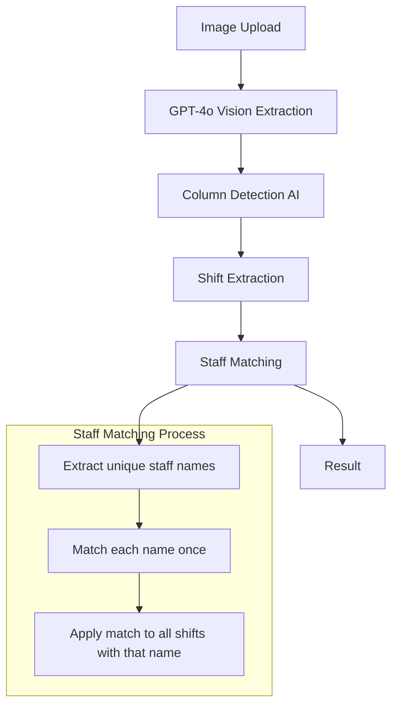
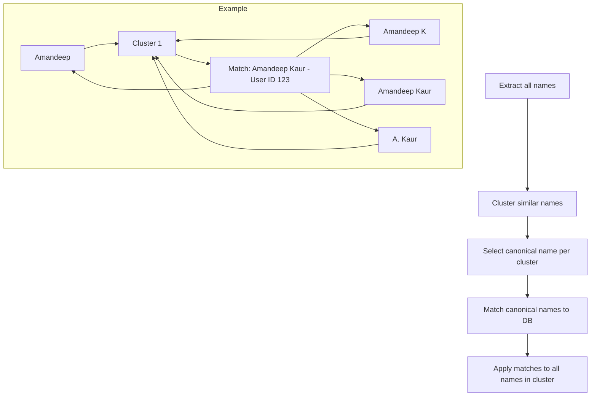

# Roster Extraction Enhancement Plan

## Problem Statement

When extracting roster data from images, the system is not correctly matching all shifts for staff members who appear multiple times. Specifically:
- **Amandeep** has 5 shifts but only 2 were matched
- Total extraction: 16 shifts, 2 matched staff, 7 unmatched staff

## Root Cause Analysis

### Current Flow



### The Core Issue

The staff matching logic in [`roster-extraction-service.ts`](src/lib/services/roster-extraction-service.ts:644-684) uses this approach:

```typescript
// Get unique staff identifiers from shifts
const uniqueStaff = new Map<string, { name: string; email: string | null }>();

for (const shift of shifts) {
  const key = (shift.staffEmail || shift.staffName || "").toLowerCase();
  if (key && !uniqueStaff.has(key)) {
    uniqueStaff.set(key, {
      name: shift.staffName || "",
      email: shift.staffEmail,
    });
  }
}
```

**Problem**: If the AI extracts slightly different name variations for the same person:
- Row 1: `Amandeep` → Matched to database user
- Row 2: `Amandeep` → Same key, uses cached match ✅
- Row 3: `Amandeep K` → Different key, treated as new person ❌
- Row 4: `Amandeep Kaur` → Different key, treated as new person ❌
- Row 5: `A. Kaur` → Different key, treated as new person ❌

Each unique extracted name gets matched independently, causing fragmentation.

### Secondary Issues

1. **No name consolidation**: The system doesn't attempt to group similar extracted names before matching
2. **Limited fuzzy matching**: Current Levenshtein distance threshold of 0.7 may not catch all variations
3. **No context-aware matching**: Doesn't consider that the same person might appear multiple times in a roster
4. **No nickname handling**: Can't match `Amandeep` to `Aman` or similar nicknames

---

## Proposed Enhancements

### Enhancement 1: Pre-Matching Name Consolidation

**Goal**: Group similar extracted names BEFORE matching to database

**Approach**:
1. Collect all unique extracted names
2. Use clustering algorithm to group similar names
3. Pick a canonical name for each cluster
4. Match canonical names to database
5. Apply match to all names in the cluster



**Implementation**:
- Add `clusterSimilarNames()` function using string similarity
- Use enhanced similarity algorithm combining:
  - Levenshtein distance
  - Jaro-Winkler similarity (better for name matching)
  - Initial expansion (`A. Kaur` → `Amandeep Kaur`)

### Enhancement 2: AI-Powered Name Resolution

**Goal**: Use GPT-4 to intelligently consolidate name variations

**Approach**:
1. Send all extracted unique names to GPT-4
2. Ask GPT-4 to group names that likely refer to the same person
3. Use GPT-4's understanding of name patterns, nicknames, and cultural variations

**Prompt Example**:
```
Given these names extracted from a roster, group them by likely referring to the same person.
Consider: nicknames, abbreviations, initials, spelling variations, cultural name patterns.

Names: ["Amandeep", "Amandeep K", "Amandeep Kaur", "A. Kaur", "John Smith", "J. Smith"]

Return JSON:
{
  "groups": [
    {
      "canonical": "Amandeep Kaur",
      "variants": ["Amandeep", "Amandeep K", "Amandeep Kaur", "A. Kaur"]
    },
    {
      "canonical": "John Smith",
      "variants": ["John Smith", "J. Smith"]
    }
  ]
}
```

### Enhancement 3: Enhanced Fuzzy Matching

**Goal**: Improve the matching algorithm to handle more variations

**Current matching priority**:
1. Exact email match (100%)
2. Exact name match (95%)
3. Fuzzy name match (70%+ similarity)
4. Partial match (first name only, 60%)

**Proposed additions**:
5. **Initial expansion match**: Expand `A. Kaur` to possible full names and match
6. **Phonetic match**: Use Soundex or Metaphone for pronunciation-based matching
7. **Nickname database**: Common nicknames (`Bob` → `Robert`, `Liz` → `Elizabeth`)
8. **Cultural patterns**: Handle common patterns like:
   - `Singh, Amandeep` → `Amandeep Singh`
   - `Kaur, Harpreet` → `Harpreet Kaur`

### Enhancement 4: Context-Aware Extraction

**Goal**: Improve the initial AI extraction to produce consistent names

**Current image extraction prompt** (simplified):
```
Extract EVERY row of shift data you can see
```

**Enhanced prompt**:
```
Extract roster data with these rules:
1. Use CONSISTENT naming - if you see "Amandeep" and "Amandeep K", use the same name for both
2. Prefer the FULL NAME when available
3. If you see an initial like "A. Kaur", try to find the full name elsewhere in the roster
4. Common columns: Staff Name, Date, Day, Start Time, End Time, Position
```

### Enhancement 5: Post-Match Validation

**Goal**: Detect and fix matching issues after initial matching

**Approach**:
1. After matching, check for unmatched names that are similar to matched names
2. Prompt user: "Is 'Amandeep K' the same as 'Amandeep'?"
3. Allow manual consolidation in the UI
4. Learn from user corrections for future extractions

---

## Implementation Priority

| Priority | Enhancement | Impact | Effort |
|----------|-------------|--------|--------|
| 1 | Pre-Matching Name Consolidation | High | Medium |
| 2 | Enhanced Fuzzy Matching | High | Medium |
| 3 | Context-Aware Extraction | Medium | Low |
| 4 | AI-Powered Name Resolution | High | Medium |
| 5 | Post-Match Validation | Medium | High |

---

## Recommended Implementation Order

### Phase 1: Quick Wins
1. **Enhance the image extraction prompt** to request consistent naming
2. **Add initial expansion matching** for patterns like `A. Kaur`

### Phase 2: Core Improvements
3. **Implement name clustering** using Jaro-Winkler similarity
4. **Add phonetic matching** using Soundex/Metaphone

### Phase 3: AI Enhancement
5. **Add GPT-4 name resolution** for intelligent consolidation
6. **Add post-match validation UI** for user confirmation

---

## Technical Details

### Files to Modify

1. **[`src/lib/services/roster-extraction-service.ts`](src/lib/services/roster-extraction-service.ts)**
   - Add `clusterSimilarNames()` function
   - Enhance `findBestStaffMatch()` with new matching strategies
   - Update `extractFromImage()` prompt

2. **[`src/lib/schemas/rosters/extraction.ts`](src/lib/schemas/rosters/extraction.ts)**
   - Add `NameCluster` type
   - Add `canonicalName` field to `StaffMatch`

3. **New file: `src/lib/utils/name-matching.ts`**
   - `calculateJaroWinklerSimilarity()`
   - `expandInitials()`
   - `getPhoneticCode()`
   - `clusterNames()`

### Dependencies to Add

```json
{
  "dependencies": {
    "talisman": "^1.0.0"  // For Jaro-Winkler, Soundex, Metaphone
  }
}
```

Or implement natively without dependencies.

---

## Questions for User

1. **Priority**: Should we focus on improving the AI extraction prompt first (quick win) or dive into the name clustering algorithm (more robust)?

2. **User Interaction**: Do you want a UI step where users can manually confirm/merge similar names before final matching?

3. **Learning**: Should the system remember manual corrections for future extractions? This would require database changes.

4. **Performance**: The AI-powered name resolution adds ~2-3 seconds per extraction. Is this acceptable?

---

## Next Steps

After user feedback, I will:
1. Finalize the implementation approach
2. Create detailed code changes
3. Add tests for the new matching logic
4. Update the extraction flow
