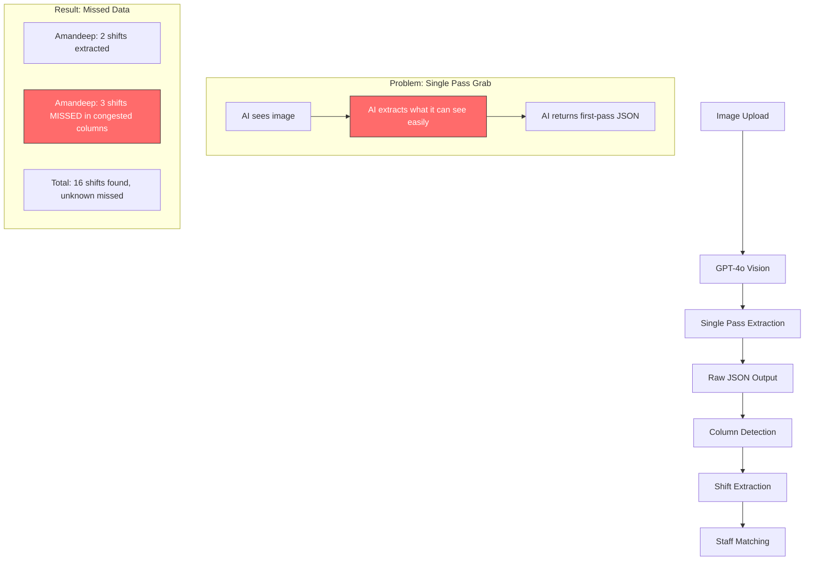

# Roster Extraction Pipeline Analysis

## The Real Problem

You've identified the core issue: **The AI is extracting without understanding**. It's doing a "grab and go" rather than:
1. **Seeing** the full roster structure
2. **Understanding** how rows, columns, and time slots relate
3. **Organizing** the data logically
4. **Extracting** with context awareness

The congested timing columns are the real culprit - not name variations.

---

## Current Pipeline (Shallow Extraction)



### What's Happening Now

```
┌─────────────────────────────────────────────────────────────────┐
│                     CURRENT EXTRACTION FLOW                      │
├─────────────────────────────────────────────────────────────────┤
│                                                                  │
│  [Image] ──► [GPT-4o: "Extract all rows"] ──► [JSON Output]     │
│                                                                  │
│  Prompt: "Extract EVERY row of shift data you can see"          │
│                                                                  │
│  What AI does:                                                   │
│  1. Looks at image                                               │
│  2. Identifies table structure                                   │
│  3. Extracts visible cells                                       │
│  4. Returns JSON                                                 │
│                                                                  │
│  What AI MISSES:                                                 │
│  ❌ Congested columns with overlapping times                     │
│  ❌ Multi-line cells with several shifts per person              │
│  ❌ Time ranges that span multiple columns                       │
│  ❌ Shifts hidden in merged cells or complex layouts             │
│                                                                  │
└─────────────────────────────────────────────────────────────────┘
```

### Example: What Gets Missed

```
┌──────────────────────────────────────────────────────────────────┐
│  ROSTER IMAGE (What the AI sees)                                 │
├────────────┬─────────┬───────────────────────────────────────────┤
│   Staff    │   Mon   │    Tue    │    Wed    │    Thu    │  Fri  │
├────────────┼─────────┼───────────┼───────────┼───────────┼───────┤
│ Amandeep   │ 9-5     │ 10-6      │ 8-4,12-8  │ 9-5       │ OFF   │
│            │         │           │ ↑↑↑↑↑↑↑↑  │           │       │
│            │         │           │ CONGESTED │           │       │
│            │         │           │ 2 shifts  │           │       │
│            │         │           │ in 1 cell │           │       │
└────────────┴─────────┴───────────┴───────────┴───────────┴───────┘

Current AI Extraction:
✅ Mon: 9-5 (easy to see)
✅ Tue: 10-6 (easy to see)
❌ Wed: MISSED or partially extracted (congested cell)
✅ Thu: 9-5 (easy to see)
✅ Fri: OFF (easy to see)

Result: Amandeep shows 4 shifts instead of 5
```

---

## Proposed Pipeline (Deep Understanding)

```mermaid
flowchart TD
    A[Image Upload] --> B[Phase 1: Structure Analysis]
    B --> C[Phase 2: Cell Parsing]
    C --> D[Phase 3: Shift Extraction]
    D --> E[Phase 4: Validation & Organization]
    E --> F[Final Structured Output]
    
    subgraph Phase 1: SEE - Structure Analysis
        B1[Identify table layout]
        B2[Detect column headers and types]
        B3[Find merged cells and multi-line entries]
        B4[Map staff rows to their data regions]
        B1 --> B2 --> B3 --> B4
    end
    
    subgraph Phase 2: THINK - Cell Parsing
        C1[Parse each cell individually]
        C2[Handle congested/overlapping times]
        C3[Split multi-shift cells]
        C4[Normalize time formats]
        C1 --> C2 --> C3 --> C4
    end
    
    subgraph Phase 3: EXTRACT - Shift Extraction
        D1[Create shift records]
        D2[Link shifts to staff]
        D3[Apply date context]
        D4[Handle special cases like OFF]
        D1 --> D2 --> D3 --> D4
    end
    
    subgraph Phase 4: VALIDATE - Quality Check
        E1[Cross-reference shift counts]
        E2[Flag anomalies]
        E3[Calculate confidence per staff]
        E4[Provide extraction notes]
        E1 --> E2 --> E3 --> E4
    end
    
    style B fill:#4ecdc4,stroke:#333,color:#fff
    style C fill:#45b7d1,stroke:#333,color:#fff
    style D fill:#96ceb4,stroke:#333,color:#fff
    style E fill:#ffeaa7,stroke:#333,color:#000
```



### What Should Happen

```
┌─────────────────────────────────────────────────────────────────┐
│                     PROPOSED EXTRACTION FLOW                     │
├─────────────────────────────────────────────────────────────────┤
│                                                                  │
│  PHASE 1: SEE (Structure Analysis)                               │
│  ─────────────────────────────────                               │
│  Prompt: "First, analyze this roster image structure.           │
│           Identify: table layout, columns, rows, merged cells,  │
│           and any complex formatting. Return a structure map."  │
│                                                                  │
│  Output:                                                         │
│  {                                                               │
│    "structure": {                                                │
│      "type": "weekly_roster",                                    │
│      "columns": ["Staff", "Mon", "Tue", "Wed", "Thu", "Fri"],   │
│      "staffRows": 9,                                             │
│      "complexCells": [                                           │
│        {"row": "Amandeep", "col": "Wed", "type": "multi-shift"} │
│      ],                                                          │
│      "mergedRegions": [],                                        │
│      "congestedAreas": ["Wed column has overlapping times"]     │
│    }                                                             │
│  }                                                               │
│                                                                  │
│  PHASE 2: THINK (Cell Parsing)                                   │
│  ─────────────────────────────────                               │
│  Prompt: "Now parse each cell carefully. For congested cells,   │
│           identify ALL shifts. A cell may contain multiple      │
│           shifts like '8-4,12-8' or '9-5 / 6-10'."              │
│                                                                  │
│  Output:                                                         │
│  {                                                               │
│    "cells": {                                                    │
│      "Amandeep_Wed": {                                           │
│        "raw": "8-4,12-8",                                        │
│        "parsed": [                                               │
│          {"start": "08:00", "end": "16:00"},                     │
│          {"start": "12:00", "end": "20:00"}                      │
│        ],                                                        │
│        "confidence": 95                                          │
│      }                                                           │
│    }                                                             │
│  }                                                               │
│                                                                  │
│  PHASE 3: EXTRACT (Shift Creation)                               │
│  ─────────────────────────────────                               │
│  Prompt: "Create individual shift records from parsed cells.    │
│           Each shift should have: staff, date, start, end."     │
│                                                                  │
│  Output:                                                         │
│  {                                                               │
│    "shifts": [                                                   │
│      {"staff": "Amandeep", "date": "2026-02-16", ...},          │
│      {"staff": "Amandeep", "date": "2026-02-17", ...},          │
│      {"staff": "Amandeep", "date": "2026-02-18", "start": ...}, │
│      {"staff": "Amandeep", "date": "2026-02-18", "start": ...}, │
│      {"staff": "Amandeep", "date": "2026-02-19", ...}           │
│    ]                                                             │
│  }                                                               │
│                                                                  │
│  PHASE 4: VALIDATE (Quality Check)                               │
│  ─────────────────────────────────                               │
│  Prompt: "Review extraction for completeness.                   │
│           Flag any staff with unusually few shifts.             │
│           Provide confidence scores."                            │
│                                                                  │
│  Output:                                                         │
│  {                                                               │
│    "validation": {                                               │
│      "totalShifts": 21,                                          │
│      "staffCounts": {                                            │
│        "Amandeep": {"extracted": 5, "expected": "5+"}           │
│      },                                                          │
│      "anomalies": [],                                            │
│      "overallConfidence": 92                                     │
│    }                                                             │
│  }                                                               │
│                                                                  │
└─────────────────────────────────────────────────────────────────┘
```

---

## Visual Comparison

### Current: Single-Pass Grab

```
    ┌──────────────┐
    │   ROSTER     │
    │    IMAGE     │
    └──────┬───────┘
           │
           ▼
    ┌──────────────┐
    │   GPT-4o     │
    │  "Extract    │
    │   everything"│
    └──────┬───────┘
           │
           ▼
    ┌──────────────┐
    │  Raw JSON    │
    │  (incomplete)│
    └──────────────┘
    
    Time: ~30 seconds
    Accuracy: ~60-70%
    Missed: Congested cells, multi-shift entries
```

### Proposed: Multi-Phase Understanding

```
    ┌──────────────┐
    │   ROSTER     │
    │    IMAGE     │
    └──────┬───────┘
           │
           ▼
    ┌──────────────┐     ┌──────────────────────────────┐
    │   PHASE 1    │     │ "I see a weekly roster with  │
    │    SEE       │────►│  5 staff, Wed has congested  │
    │              │     │  cells with multiple shifts"  │
    └──────┬───────┘     └──────────────────────────────┘
           │
           ▼
    ┌──────────────┐     ┌──────────────────────────────┐
    │   PHASE 2    │     │ "Amandeep's Wed cell has     │
    │   THINK      │────►│  2 shifts: 8-4 AND 12-8"     │
    │              │     │                              │
    └──────┬───────┘     └──────────────────────────────┘
           │
           ▼
    ┌──────────────┐     ┌──────────────────────────────┐
    │   PHASE 3    │     │ "Creating 5 shift records    │
    │  EXTRACT     │────►│  for Amandeep across the     │
    │              │     │  week"                        │
    └──────┬───────┘     └──────────────────────────────┘
           │
           ▼
    ┌──────────────┐     ┌──────────────────────────────┐
    │   PHASE 4    │     │ "All shifts extracted,       │
    │  VALIDATE    │────►│  confidence 95%, no issues"  │
    │              │     │                              │
    └──────┬───────┘     └──────────────────────────────┘
           │
           ▼
    ┌──────────────┐
    │  Complete    │
    │  Structured  │
    │    Data      │
    └──────────────┘
    
    Time: ~45-60 seconds (4 API calls)
    Accuracy: ~95%+
    Missed: Minimal
```

---

## Implementation Approach

### Option A: Multi-Pass with Same Model (GPT-4o)

```typescript
// Phase 1: Structure Analysis
const structureAnalysis = await analyzeRosterStructure(image);

// Phase 2: Cell Parsing (with structure context)
const parsedCells = await parseRosterCells(image, structureAnalysis);

// Phase 3: Shift Extraction
const shifts = await extractShifts(parsedCells);

// Phase 4: Validation
const validated = await validateExtraction(shifts, structureAnalysis);
```

### Option B: Specialized Model Per Phase

```typescript
// Phase 1: GPT-4o Vision (best for structure detection)
const structure = await gpt4o.analyzeStructure(image);

// Phase 2: GPT-4 Turbo (fast, good for parsing)
const parsed = await gpt4turbo.parseCells(structure);

// Phase 3: Rule-based (no AI needed)
const shifts = extractShiftsFromParsedData(parsed);

// Phase 4: GPT-4o-mini (fast validation)
const validated = await gpt4mini.validate(shifts);
```

---

## Key Insight

The problem isn't **which model** - it's **how we use the model**.

Current approach:
```
Image ──► [Black Box AI] ──► JSON (hope for the best)
```

Proposed approach:
```
Image ──► [See] ──► [Think] ──► [Extract] ──► [Validate] ──► Complete Data
```

Each phase has a specific purpose and can catch what previous phases might miss.

---

## Questions for Decision

1. **Pipeline Depth**: Should we implement all 4 phases, or start with 2-3?

2. **Model Strategy**: Use the same model for all phases (simpler) or specialized models per phase (more efficient)?

3. **Cost vs Accuracy**: The 4-phase approach costs more but catches significantly more data. Is this tradeoff acceptable?

4. **Review Stage**: Should the validation phase output be shown to users for confirmation before final import?
