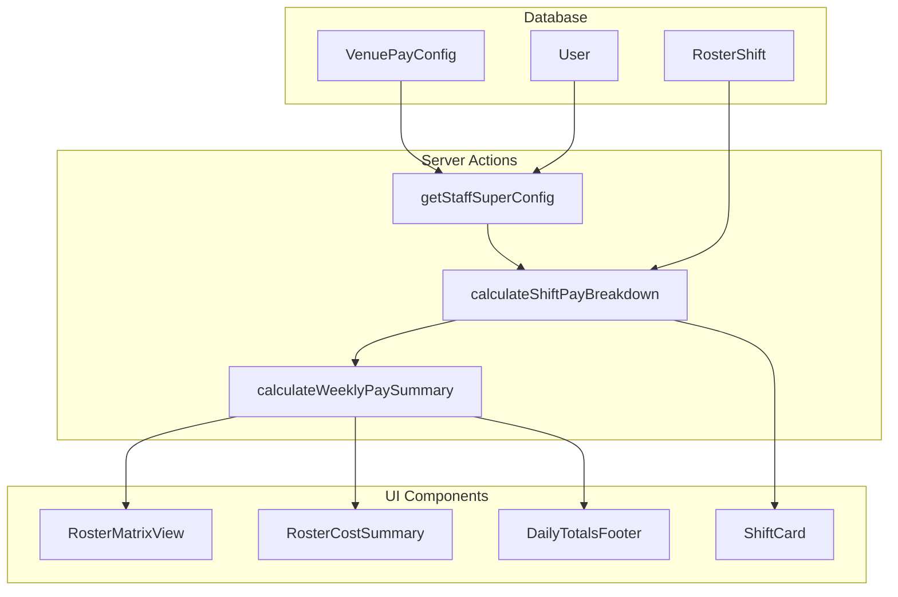

# Superannuation Calculation Implementation Plan

## Overview

This plan outlines the implementation of superannuation (super) calculation in the roster module. The system will support:
- **Venue-level default super rate** (e.g., 11.5% - current Australian Super Guarantee)
- **User-level super customization** (for employees with different arrangements)
- **Per-shift super calculation** based on eligibility
- **Daily and weekly super breakdown** in the roster view
- **Grand total summary** showing wage vs super components

---

## Current State Analysis

### Existing Pay Calculation System

**Database Schema** ([`prisma/schema.prisma`](prisma/schema.prisma)):
- `VenuePayConfig` - Contains venue-level pay rates and settings
- `User` model - Has individual pay rate fields (weekdayRate, saturdayRate, etc.)
- **Missing**: Superannuation-related fields

**Pay Calculator** ([`src/lib/utils/pay-calculator.ts`](src/lib/utils/pay-calculator.ts)):
- Calculates shift hours, base pay, overtime, late hours
- `ShiftPayBreakdown` interface includes baseHours, basePay, overtimeHours, overtimePay, lateHours, latePay, totalHours, totalPay
- **Missing**: Superannuation calculation

**Roster Matrix View** ([`src/components/rosters/roster-matrix-view.tsx`](src/components/rosters/roster-matrix-view.tsx)):
- Shows shift cards with hours and pay
- Shows daily totals (hours and cost)
- Shows staff totals (hours and pay)
- **Missing**: Superannuation display

---

## Implementation Plan

### Phase 1: Database Schema Changes

#### 1.1 Add Super Fields to VenuePayConfig

```prisma
model VenuePayConfig {
  // ... existing fields ...
  
  // Superannuation settings
  superRate              Decimal?  @db.Decimal(5, 4) @default(0.115)  // 11.5% default (2025-26 Australian SG rate)
  superEnabled           Boolean   @default(true)                     // Whether super is applicable for this venue
  superThresholdHours    Int       @default(0)                        // Minimum hours/week before super applies (usually 0)
}
```

#### 1.2 Add Super Fields to User Model

```prisma
model User {
  // ... existing pay rate fields ...
  
  // Superannuation settings (overrides venue default)
  superEnabled           Boolean?  // null = use venue default, true/false = override
  customSuperRate        Decimal?  @db.Decimal(5, 4)  // Custom rate if different from venue default
}
```

#### 1.3 Create Migration

```bash
npx prisma migrate add_superannuation_fields
```

---

### Phase 2: Pay Calculator Enhancement

#### 2.1 Update Types in [`src/lib/utils/pay-calculator.ts`](src/lib/utils/pay-calculator.ts)

```typescript
export interface SuperConfig {
  enabled: boolean;
  rate: number;  // e.g., 0.115 for 11.5%
  thresholdHours?: number;  // Minimum hours before super applies
}

export interface ShiftPayBreakdown {
  baseHours: number;
  basePay: number;
  overtimeHours: number;
  overtimePay: number;
  lateHours: number;
  latePay: number;
  totalHours: number;
  totalPay: number;
  // NEW: Superannuation
  superPay: number;        // Super amount for this shift
  superRate: number;       // Rate applied
  // Rate type and applied rates...
  rateType: "WEEKDAY" | "SATURDAY" | "SUNDAY" | "PUBLIC_HOLIDAY" | "CUSTOM";
  appliedRates: {
    base: number;
    overtime?: number;
    late?: number;
    super?: number;
  };
}

export interface WeeklyPaySummary {
  totalHours: number;
  basePay: number;
  overtimePay: number;
  latePay: number;
  grossPay: number;        // Total wage before super
  superPay: number;        // Total superannuation
  totalCost: number;       // grossPay + superPay
  superRate: number;
  dailyBreakdown: DailyPaySummary[];
  staffBreakdown: StaffPaySummary[];
}

export interface DailyPaySummary {
  date: Date;
  dateKey: string;
  totalHours: number;
  basePay: number;
  overtimePay: number;
  latePay: number;
  grossPay: number;
  superPay: number;
  totalCost: number;
  shiftCount: number;
}

export interface StaffPaySummary {
  staffId: string;
  staffName: string;
  totalHours: number;
  basePay: number;
  overtimePay: number;
  latePay: number;
  grossPay: number;
  superPay: number;
  totalCost: number;
  superEnabled: boolean;
  superRate: number;
}
```

#### 2.2 Add Super Calculation Functions

```typescript
/**
 * Get effective super configuration for a staff member
 */
export function getEffectiveSuperConfig(
  userSuperEnabled: boolean | null,
  userSuperRate: Decimal | number | null,
  venueSuperEnabled: boolean,
  venueSuperRate: Decimal | number | null,
  venueThresholdHours: number = 0
): SuperConfig {
  // Determine if super is enabled
  const enabled = userSuperEnabled !== null 
    ? userSuperEnabled 
    : venueSuperEnabled;
  
  if (!enabled) {
    return { enabled: false, rate: 0, thresholdHours: 0 };
  }
  
  // Determine rate (user override or venue default)
  const rate = toNumber(userSuperRate) 
    ?? toNumber(venueSuperRate) 
    ?? 0.115;  // Default to current Australian SG rate
  
  return {
    enabled: true,
    rate,
    thresholdHours: venueThresholdHours
  };
}

/**
 * Calculate superannuation for a shift
 */
export function calculateShiftSuper(
  grossPay: number,
  superConfig: SuperConfig
): number {
  if (!superConfig.enabled || grossPay <= 0) {
    return 0;
  }
  
  const superAmount = grossPay * superConfig.rate;
  return Math.round(superAmount * 100) / 100;
}

/**
 * Calculate weekly super for a staff member
 * (Accounts for threshold hours if applicable)
 */
export function calculateWeeklySuper(
  grossPay: number,
  totalHours: number,
  superConfig: SuperConfig
): number {
  if (!superConfig.enabled) {
    return 0;
  }
  
  // Check threshold
  if (superConfig.thresholdHours > 0 && totalHours < superConfig.thresholdHours) {
    return 0;
  }
  
  return calculateShiftSuper(grossPay, superConfig);
}
```

#### 2.3 Update `calculateShiftPayBreakdown` Function

Add super calculation to the existing function:

```typescript
export function calculateShiftPayBreakdown(
  shift: ShiftPayInput,
  rates: StaffPayRates,
  venueConfig?: VenuePayConfig | null,
  customRates?: CustomRate[],
  superConfig?: SuperConfig  // NEW parameter
): ShiftPayBreakdown | null {
  // ... existing calculation logic ...
  
  // Calculate super
  const effectiveSuperConfig = superConfig || {
    enabled: venueConfig?.superEnabled ?? true,
    rate: toNumber(venueConfig?.superRate) ?? 0.115,
    thresholdHours: venueConfig?.superThresholdHours ?? 0
  };
  
  const superPay = calculateShiftSuper(totalPay, effectiveSuperConfig);
  
  return {
    baseHours,
    basePay: Math.round(basePay * 100) / 100,
    overtimeHours,
    overtimePay,
    lateHours,
    latePay,
    totalHours,
    totalPay: Math.round(totalPay * 100) / 100,
    // NEW
    superPay,
    superRate: effectiveSuperConfig.rate,
    rateType,
    appliedRates: {
      base: baseRate,
      overtime: overtimeRate || undefined,
      late: lateRate || undefined,
      super: effectiveSuperConfig.enabled ? effectiveSuperConfig.rate : undefined
    }
  };
}
```

#### 2.4 Add Weekly Summary Calculation Function

```typescript
/**
 * Calculate comprehensive weekly pay summary
 */
export function calculateWeeklyPaySummary(
  shifts: Array<ShiftPayInput & { userId: string; shiftId: string }>,
  staffRates: Record<string, StaffPayRates>,
  staffSuperConfig: Record<string, SuperConfig>,
  venueConfig?: VenuePayConfig | null
): WeeklyPaySummary {
  const dailyMap = new Map<string, DailyPaySummary>();
  const staffMap = new Map<string, StaffPaySummary>();
  
  let totalHours = 0;
  let basePay = 0;
  let overtimePay = 0;
  let latePay = 0;
  let grossPay = 0;
  let superPay = 0;
  
  for (const shift of shifts) {
    const rates = staffRates[shift.userId];
    const superCfg = staffSuperConfig[shift.userId] || { enabled: true, rate: 0.115 };
    
    if (!rates) continue;
    
    const breakdown = calculateShiftPayBreakdown(shift, rates, venueConfig, undefined, superCfg);
    if (!breakdown) continue;
    
    // Accumulate totals
    totalHours += breakdown.totalHours;
    basePay += breakdown.basePay;
    overtimePay += breakdown.overtimePay;
    latePay += breakdown.latePay;
    grossPay += breakdown.totalPay;
    superPay += breakdown.superPay;
    
    // Daily breakdown
    const dateKey = formatDate(shift.date);
    const existing = dailyMap.get(dateKey) || {
      date: shift.date,
      dateKey,
      totalHours: 0,
      basePay: 0,
      overtimePay: 0,
      latePay: 0,
      grossPay: 0,
      superPay: 0,
      totalCost: 0,
      shiftCount: 0
    };
    
    existing.totalHours += breakdown.totalHours;
    existing.basePay += breakdown.basePay;
    existing.overtimePay += breakdown.overtimePay;
    existing.latePay += breakdown.latePay;
    existing.grossPay += breakdown.totalPay;
    existing.superPay += breakdown.superPay;
    existing.totalCost += breakdown.totalPay + breakdown.superPay;
    existing.shiftCount++;
    
    dailyMap.set(dateKey, existing);
    
    // Staff breakdown
    const existingStaff = staffMap.get(shift.userId) || {
      staffId: shift.userId,
      staffName: '',  // To be filled by caller
      totalHours: 0,
      basePay: 0,
      overtimePay: 0,
      latePay: 0,
      grossPay: 0,
      superPay: 0,
      totalCost: 0,
      superEnabled: superCfg.enabled,
      superRate: superCfg.rate
    };
    
    existingStaff.totalHours += breakdown.totalHours;
    existingStaff.basePay += breakdown.basePay;
    existingStaff.overtimePay += breakdown.overtimePay;
    existingStaff.latePay += breakdown.latePay;
    existingStaff.grossPay += breakdown.totalPay;
    existingStaff.superPay += breakdown.superPay;
    existingStaff.totalCost += breakdown.totalPay + breakdown.superPay;
    
    staffMap.set(shift.userId, existingStaff);
  }
  
  return {
    totalHours,
    basePay: Math.round(basePay * 100) / 100,
    overtimePay: Math.round(overtimePay * 100) / 100,
    latePay: Math.round(latePay * 100) / 100,
    grossPay: Math.round(grossPay * 100) / 100,
    superPay: Math.round(superPay * 100) / 100,
    totalCost: Math.round((grossPay + superPay) * 100) / 100,
    superRate: 0.115,  // Average or venue default
    dailyBreakdown: Array.from(dailyMap.values()),
    staffBreakdown: Array.from(staffMap.values())
  };
}
```

---

### Phase 3: Server Actions Update

#### 3.1 Update [`src/lib/actions/admin/venue-pay-config.ts`](src/lib/actions/admin/venue-pay-config.ts)

Add super fields to the venue pay config actions:

```typescript
// Add to saveVenuePayConfig function
superRate: data.superRate,
superEnabled: data.superEnabled,
superThresholdHours: data.superThresholdHours,
```

#### 3.2 Update Roster Data Fetching

In [`src/app/manage/rosters/[id]/page.tsx`](src/app/manage/rosters/[id]/page.tsx), fetch super config:

```typescript
// Fetch venue super config
const venuePayConfig = await prisma.venuePayConfig.findUnique({
  where: { venueId: roster.venueId },
  select: {
    superRate: true,
    superEnabled: true,
    superThresholdHours: true,
    // ... other fields
  }
});

// Fetch user super settings
const userSuperSettings = await prisma.user.findMany({
  where: { id: { in: staffIds } },
  select: {
    id: true,
    superEnabled: true,
    customSuperRate: true
  }
});
```

---

### Phase 4: UI Components Update

#### 4.1 Update Shift Card in [`roster-matrix-view.tsx`](src/components/rosters/roster-matrix-view.tsx)

Add super display to shift cards:

```tsx
{/* Row 3: Hours + Break + Pay + Super */}
<div className="flex flex-wrap gap-2 text-xs text-gray-600 mt-2">
  <span className="flex items-center gap-1 bg-white/60 rounded px-1.5 py-0.5">
    <Clock className="h-3 w-3" />
    {formatHours(hours)}
  </span>
  {shift.breakMinutes > 0 && (
    <span className="flex items-center gap-1 bg-white/60 rounded px-1.5 py-0.5">
      <Coffee className="h-3 w-3" />
      {shift.breakMinutes}m
    </span>
  )}
  {shiftPay !== null && (
    <span className="flex items-center gap-1 font-semibold text-emerald-600 bg-emerald-100/80 rounded px-1.5 py-0.5 ml-auto">
      {formatCurrency(shiftPay)}
    </span>
  )}
</div>

{/* NEW: Super indicator */}
{showPay && superAmount > 0 && (
  <div className="text-xs text-purple-600 mt-1 flex items-center gap-1">
    <PiggyBank className="h-3 w-3" />
    <span>+{formatCurrency(superAmount)} super</span>
  </div>
)}
```

#### 4.2 Update Staff Totals Display

```tsx
<div className="flex items-center gap-2 mt-1">
  <span className="text-xs font-medium text-gray-600 bg-gray-100 rounded px-1.5 py-0.5">
    {formatHours(totals.hours)}
  </span>
  {totals.pay !== null && (
    <span className="text-xs font-semibold text-emerald-600 bg-emerald-50 rounded px-1.5 py-0.5">
      {formatCurrency(totals.pay)}
    </span>
  )}
  {/* NEW: Super total */}
  {totals.super > 0 && (
    <span className="text-xs font-semibold text-purple-600 bg-purple-50 rounded px-1.5 py-0.5">
      +{formatCurrency(totals.super)} super
    </span>
  )}
</div>
```

#### 4.3 Update Daily Totals Footer

```tsx
{/* Footer row - Daily Totals with Super */}
{canViewPayRates && (
  <div className="grid grid-cols-[220px_repeat(7,1fr)] border-t-2 border-slate-300 bg-gradient-to-r from-slate-50 to-slate-100">
    <div className="p-4 font-semibold text-xs text-slate-700 uppercase tracking-wider border-r bg-slate-100 flex items-center">
      <span>Daily Totals</span>
    </div>
    {weekDays.map((day) => {
      const dateKey = format(day, "yyyy-MM-dd");
      const dayTotal = externalDailyTotals?.get(dateKey) || { hours: 0, cost: 0, super: 0 };
      return (
        <div key={dateKey} className="p-4 text-center border-r last:border-r-0 bg-gradient-to-b from-white to-slate-50">
          <div className="text-base font-bold text-slate-800 mb-1">
            {formatHours(dayTotal.hours)}
          </div>
          <div className="text-sm font-semibold text-emerald-600 bg-emerald-50 rounded-md py-0.5 px-2 inline-block">
            {formatCurrency(dayTotal.cost)}
          </div>
          {/* NEW: Super */}
          {dayTotal.super > 0 && (
            <div className="text-xs font-medium text-purple-600 mt-1">
              +{formatCurrency(dayTotal.super)} super
            </div>
          )}
        </div>
      );
    })}
  </div>
)}
```

#### 4.4 Add Grand Total Summary Section

Create a new component `roster-cost-summary.tsx`:

```tsx
"use client";

import { Card, CardContent, CardHeader, CardTitle } from "@/components/ui/card";
import { formatCurrency, formatHours } from "@/lib/utils/pay-calculator";
import { PiggyBank, DollarSign, Clock, Users } from "lucide-react";

interface RosterCostSummaryProps {
  totalHours: number;
  grossPay: number;
  superPay: number;
  totalCost: number;
  staffCount: number;
  shiftCount: number;
  superRate: number;
}

export function RosterCostSummary({
  totalHours,
  grossPay,
  superPay,
  totalCost,
  staffCount,
  shiftCount,
  superRate
}: RosterCostSummaryProps) {
  const superPercentage = (superRate * 100).toFixed(1);
  
  return (
    <Card className="bg-gradient-to-br from-slate-50 to-white border-slate-200">
      <CardHeader className="pb-3">
        <CardTitle className="text-lg font-semibold text-slate-800 flex items-center gap-2">
          <DollarSign className="h-5 w-5 text-emerald-600" />
          Weekly Cost Summary
        </CardTitle>
      </CardHeader>
      <CardContent>
        <div className="grid grid-cols-2 md:grid-cols-4 gap-4">
          {/* Total Hours */}
          <div className="bg-white rounded-lg p-3 border border-slate-200">
            <div className="flex items-center gap-2 text-slate-500 text-sm mb-1">
              <Clock className="h-4 w-4" />
              Total Hours
            </div>
            <div className="text-2xl font-bold text-slate-800">
              {formatHours(totalHours)}
            </div>
          </div>
          
          {/* Gross Pay */}
          <div className="bg-white rounded-lg p-3 border border-slate-200">
            <div className="flex items-center gap-2 text-slate-500 text-sm mb-1">
              <DollarSign className="h-4 w-4 text-emerald-600" />
              Gross Wage
            </div>
            <div className="text-2xl font-bold text-emerald-600">
              {formatCurrency(grossPay)}
            </div>
          </div>
          
          {/* Super */}
          <div className="bg-white rounded-lg p-3 border border-slate-200">
            <div className="flex items-center gap-2 text-slate-500 text-sm mb-1">
              <PiggyBank className="h-4 w-4 text-purple-600" />
              Superannuation ({superPercentage}%)
            </div>
            <div className="text-2xl font-bold text-purple-600">
              {formatCurrency(superPay)}
            </div>
          </div>
          
          {/* Total Cost */}
          <div className="bg-gradient-to-br from-blue-50 to-white rounded-lg p-3 border border-blue-200">
            <div className="flex items-center gap-2 text-blue-600 text-sm mb-1 font-medium">
              <DollarSign className="h-4 w-4" />
              Total Cost
            </div>
            <div className="text-2xl font-bold text-blue-700">
              {formatCurrency(totalCost)}
            </div>
          </div>
        </div>
        
        {/* Additional Stats */}
        <div className="flex gap-6 mt-4 pt-4 border-t border-slate-200 text-sm text-slate-600">
          <div className="flex items-center gap-2">
            <Users className="h-4 w-4" />
            <span>{staffCount} staff</span>
          </div>
          <div className="flex items-center gap-2">
            <Clock className="h-4 w-4" />
            <span>{shiftCount} shifts</span>
          </div>
        </div>
      </CardContent>
    </Card>
  );
}
```

#### 4.5 Add Super Settings to Venue Pay Config Page

In the venue pay settings page, add a new section:

```tsx
{/* Superannuation Settings */}
<Card>
  <CardHeader>
    <CardTitle className="flex items-center gap-2">
      <PiggyBank className="h-5 w-5 text-purple-600" />
      Superannuation Settings
    </CardTitle>
    <CardDescription>
      Configure default superannuation rates for this venue
    </CardDescription>
  </CardHeader>
  <CardContent className="space-y-4">
    <div className="flex items-center justify-between">
      <div>
        <Label htmlFor="superEnabled">Superannuation Enabled</Label>
        <p className="text-sm text-muted-foreground">
          Enable super calculation for staff at this venue
        </p>
      </div>
      <Switch
        id="superEnabled"
        checked={config.superEnabled}
        onCheckedChange={(checked) => updateConfig("superEnabled", checked)}
      />
    </div>
    
    <div className="space-y-2">
      <Label htmlFor="superRate">Default Super Rate (%)</Label>
      <div className="flex items-center gap-2">
        <Input
          id="superRate"
          type="number"
          step="0.1"
          value={(config.superRate * 100).toFixed(1)}
          onChange={(e) => updateConfig("superRate", parseFloat(e.target.value) / 100)}
          className="w-24"
        />
        <span className="text-muted-foreground">%</span>
      </div>
      <p className="text-sm text-muted-foreground">
        Current Australian Super Guarantee rate: 11.5% (2025-26)
      </p>
    </div>
  </CardContent>
</Card>
```

#### 4.6 Add Super Settings to User Profile (Admin View)

For admins/managers to customize super for individual users:

```tsx
{/* Superannuation Override */}
<Card>
  <CardHeader>
    <CardTitle className="text-sm">Superannuation Settings</CardTitle>
  </CardHeader>
  <CardContent className="space-y-4">
    <div className="flex items-center justify-between">
      <div>
        <Label>Super Eligibility</Label>
        <p className="text-xs text-muted-foreground">
          Override venue default setting
        </p>
      </div>
      <Select
        value={user.superEnabled === null ? "default" : user.superEnabled ? "enabled" : "disabled"}
        onValueChange={(value) => {
          updateUser("superEnabled", value === "default" ? null : value === "enabled");
        }}
      >
        <SelectTrigger className="w-32">
          <SelectValue />
        </SelectTrigger>
        <SelectContent>
          <SelectItem value="default">Use Venue Default</SelectItem>
          <SelectItem value="enabled">Enabled</SelectItem>
          <SelectItem value="disabled">Disabled</SelectItem>
        </SelectContent>
      </Select>
    </div>
    
    <div className="space-y-2">
      <Label>Custom Super Rate (Optional)</Label>
      <div className="flex items-center gap-2">
        <Input
          type="number"
          step="0.1"
          value={user.customSuperRate ? (user.customSuperRate * 100).toFixed(1) : ""}
          onChange={(e) => updateUser("customSuperRate", parseFloat(e.target.value) / 100 || null)}
          placeholder="Use venue default"
          className="w-24"
        />
        <span className="text-muted-foreground">%</span>
      </div>
    </div>
  </CardContent>
</Card>
```

---

### Phase 5: Export Enhancement

#### 5.1 Update Excel Export

Include super columns in the roster Excel export:

| Date | Staff | Start | End | Hours | Base Pay | OT Pay | Late Pay | Gross | Super | Total Cost |
|------|-------|-------|-----|-------|----------|--------|----------|-------|-------|------------|

#### 5.2 Add Summary Sheet

Create a summary sheet in the Excel export with:
- Total hours
- Total gross wage
- Total superannuation
- Total cost
- Per-staff breakdown

---

## Implementation Checklist

### Phase 1: Database Schema
- [ ] Add `superRate`, `superEnabled`, `superThresholdHours` to `VenuePayConfig` model
- [ ] Add `superEnabled`, `customSuperRate` to `User` model
- [ ] Create and run Prisma migration
- [ ] Update Prisma client

### Phase 2: Pay Calculator
- [ ] Add `SuperConfig` interface
- [ ] Add super fields to `ShiftPayBreakdown` interface
- [ ] Create `WeeklyPaySummary`, `DailyPaySummary`, `StaffPaySummary` interfaces
- [ ] Implement `getEffectiveSuperConfig()` function
- [ ] Implement `calculateShiftSuper()` function
- [ ] Implement `calculateWeeklySuper()` function
- [ ] Update `calculateShiftPayBreakdown()` to include super
- [ ] Implement `calculateWeeklyPaySummary()` function

### Phase 3: Server Actions
- [ ] Update venue pay config actions for super fields
- [ ] Update roster data fetching to include super config
- [ ] Create `getStaffSuperConfig()` helper function

### Phase 4: UI Components
- [ ] Add super display to shift cards
- [ ] Add super to staff totals display
- [ ] Add super to daily totals footer
- [ ] Create `RosterCostSummary` component
- [ ] Add super settings to venue pay config page
- [ ] Add super override to user profile (admin view)
- [ ] Update roster editor client to pass super data

### Phase 5: Export
- [ ] Add super columns to Excel export
- [ ] Add summary sheet with super breakdown
- [ ] Update PDF export to include super

### Phase 6: Testing
- [ ] Test super calculation with various rates
- [ ] Test user-level super override
- [ ] Test venue-level super settings
- [ ] Test export with super data
- [ ] Verify super display in matrix view

---

## Data Flow Diagram



---

## Australian Superannuation Context

### Current Super Guarantee Rates
- 2024-25: 11.5%
- 2025-26: 11.5%
- 2026-27: 12%
- 2027-28: 12%
- From 2028-29: 12.5%

### Implementation Notes
1. Default rate should be set to current SG rate (11.5%)
2. System should allow for rate changes (historical rosters should preserve the rate used)
3. Some employees may be exempt from super (e.g., under 18 working < 30 hours/week)
4. Some employees may have salary sacrifice arrangements affecting super calculations

---

## Clarified Requirements

Based on stakeholder feedback:

1. **Historical Data**: ✅ Rosters should preserve the super rate at time of creation/publishing

2. **Super Threshold**: ❌ No threshold implementation needed (simplified approach)

3. **User-Level Override**: ✅ Both disable option AND custom rate override for individual users

4. **Super Fund Tracking**: ✅ Track super fund details for each employee (fund name, member number, USI)

5. **Reporting**: ✅ Build comprehensive reports:
   - Income/wage reports
   - Hours reports
   - Superannuation reports
   - Expense/cost reports

---

## Extended Implementation: Super Fund Tracking

### Phase 1.1: Additional Database Fields for Super Fund

Add to User model:

```prisma
model User {
  // ... existing fields ...
  
  // Superannuation Fund Details
  superFundName           String?   // e.g., "AustralianSuper", "Hostplus"
  superFundMemberNumber   String?   // Employee's member number
  superFundUSI            String?   // Unique Superannuation Identifier
  superFundABN            String?   // Fund ABN (optional, for verification)
}
```

### Phase 1.2: Store Super Rate on Roster

Add to Roster model to preserve historical rates:

```prisma
model Roster {
  // ... existing fields ...
  
  // Snapshot of super rate at time of publishing
  publishedSuperRate      Decimal?  @db.Decimal(5, 4)  // Rate when published
  totalGrossPay           Decimal?  @db.Decimal(12, 2) // Total wages
  totalSuperPay           Decimal?  @db.Decimal(12, 2) // Total super
  totalCost               Decimal?  @db.Decimal(12, 2) // Total including super
}
```

---

## Extended Implementation: Reporting Module

### New Reports to Build

#### 1. Wage Report
- Date range filter
- Venue filter
- Staff filter
- Columns: Date, Staff, Hours, Base Pay, OT Pay, Late Pay, Gross Pay
- Totals and averages

#### 2. Superannuation Report
- Date range filter
- Venue filter
- Staff filter
- Show super-eligible vs non-eligible staff
- Columns: Staff, Gross Wage, Super Rate, Super Amount, Super Fund
- Export for super clearing house

#### 3. Hours Report
- Date range filter
- By staff, by day, by position
- Overtime hours breakdown
- Late hours breakdown

#### 4. Cost Report
- Venue cost breakdown
- Daily/weekly/monthly totals
- Wage vs Super split
- Budget comparison (if budgets implemented)

### Report Architecture

Create new files:
- `src/lib/actions/reports/wage-reports.ts`
- `src/lib/actions/reports/super-reports.ts`
- `src/lib/actions/reports/hours-reports.ts`
- `src/lib/actions/reports/cost-reports.ts`
- `src/app/manage/reports/page.tsx` - Reports landing page
- `src/app/manage/reports/wages/page.tsx`
- `src/app/manage/reports/super/page.tsx`
- `src/app/manage/reports/hours/page.tsx`
- `src/app/manage/reports/costs/page.tsx`
